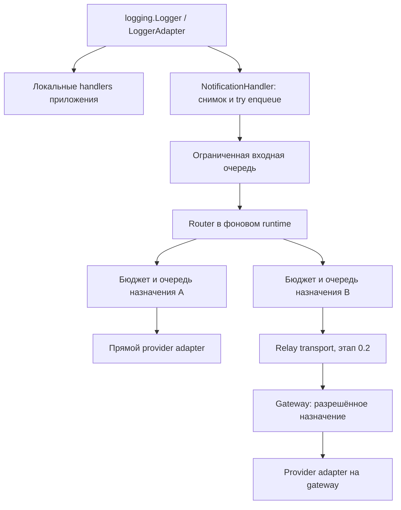

# Remote Watch — архитектура

Version 1.0.4

Автор: Sergey Fundobny (silverbull@mail.ru) + GPT-6

Дата и время последнего изменения: 260928-160026

## Статус и границы

Это спецификация целевого поведения с частичной реализацией. В текущем каркасе
есть Identity/Notification, Delivery/DeliveryResult, типизированная конфигурация,
NotificationChannel и реестр пользовательских команд. Реализован также полный путь
logging → подготовка данных → очереди → канал. Версия 0.1.0.dev3 поддерживает
ограниченные повторы, full jitter, retry-after, TTL, sync/async lifecycle и счётчики
по получателям. Реализованы исходящие Telegram/ntfy; gateway ещё отсутствует.
Адаптеры проверены без внешних сервисов, доставка на телефон не проверена. Текущий API и границы:
[RUNTIME.md](docs/RUNTIME.md). Scope определяет
[PROJECT_BRIEF.md](PROJECT_BRIEF.md), порядок реализации —
[IMPLEMENTATION_PLAN.md](docs/IMPLEMENTATION_PLAN.md).

0.1: локальное logging и прямые исходящие Telegram/ntfy-уведомления.
0.2: необязательный relay. 0.3: отдельный приём и маршрутизация команд.
Совместимость с `fin-data.TelegramBot` не является целью.

## Основные решения

- Основной пользовательский API — `logging.Logger`, без обязательного подкласса.
- Консоль/файл и удалённые уведомления обслуживаются независимо.
- Вызов logging не выполняет сеть, не ждёт освобождения очереди и не делает retry.
- Core знает протоколы и назначения, конкретные адаптеры изолированы.
- Назначение выбирает `direct` или `relay`; код приложения от этого не зависит.
- Все очереди, активные отправки и отложенные повторы имеют конечные бюджеты.
- Один gateway владеет приёмом команд из общего канала, но исходящей отправке
  нескольких процессов gateway сам по себе не требуется.
- Нет встроенного удалённого shell или выполнения произвольного Python.

## Потоки данных

Remote Watch не перемещает существующие локальные handlers в свою очередь.
Они могут оставаться синхронными. При необходимости приложение отдельно использует
стандартный QueueHandler/QueueListener для локального I/O. Удобная настройка
пакета создаёт только явно запрошенные handlers и помнит владение ими.

Фоновый runtime использует один управляемый поток и собственный asyncio loop.
Он не меняет event loop приложения. Для каждого назначения создаётся ограниченный
исполнитель; ожидание сети или backoff не блокирует соседние назначения.
Нельзя выполнять синхронный provider SDK в этом loop. Обёртка sync-клиента через
thread pool не даёт гарантии отмены; в первых адаптерах нужен настоящий async I/O.

## Идентичность и модели

### Identity

Обязательные явно заданные поля: `service`, `environment`, `region`, `host`,
`instance_id`. Неизвестное значение задаётся явно, а не берётся из display name.
`instance_id` обозначает логическое развёртывание; одновременно работающие
instances в одной области регистрации обязаны иметь разные ID. Для каждого
запуска runtime создаётся отдельный `session_id`. Перезапуск не подменяет старую
сессию молча в command hub. LogRecord не может переопределить identity runtime.

### Notification

Неизменяемый сериализуемый снимок содержит:

- `schema_version`, `event_id`, UTC `created_at`, `expires_at`;
- identity и `session_id`;
- числовой `level_no`, текстовый `level_name`, `logger_name`;
- отформатированный `message`, необязательный текст исключения;
- необязательные `topic`, `tags`, correlation/trace IDs;
- признак явного `notify` и признаки усечения.

Сообщение и исключение фиксируются до постановки в очередь. Снимок не хранит
LogRecord, traceback, произвольные `args` и ссылки на изменяемые объекты приложения.
Разрешены только документированные поля и ограниченные простые типы метаданных.
Изменение исходного LogRecord не допускается: другие handlers должны его сохранить.
Ошибки форматирования/нормализации дают безопасную локальную диагностику и счётчик,
но не пробрасываются в приложение из handler.

Редактор чувствительных данных применяется до помещения снимка в очередь.
Полные URL с токеном, секреты конфигурации и provider payload в снимок не входят.
Редактирование не гарантирует распознавания произвольного секрета в тексте приложения.

### Destination и Delivery

`Destination` — логическое именованное назначение с фиксированными настройками:
провайдер, способ доставки, ссылка на прямую конфигурацию или relay binding,
политика очереди/retry. Один Telegram-чат и один ntfy-topic — разные назначения.
Router возвращает уникальные destination IDs, без provider-specific параметров.

`Delivery` связывает событие и одно назначение: стабильный `delivery_id`,
номер попытки, срок жизни и состояние. Все повторы одной доставки используют
тот же ID. Снимок события не изменяется при рендеринге разных провайдеров.

### Результат одной попытки

| Результат | Смысл | Действие core |
| --- | --- | --- |
| `provider_accepted` | Провайдер подтвердил приём | Завершить доставку |
| `transient_failure` | Известный временный отказ | Повтор в пределах политики |
| `rate_limited` | Провайдер/relay ограничил частоту | Учесть минимальное время повтора |
| `permanent_failure` | Известный неповторяемый отказ | Завершить с ошибкой |
| `unknown` | Отправка могла состояться, подтверждения нет | Повтор по политике, возможен дубликат |

Результат содержит безопасный код причины, необязательные provider message ID
и `retry_after`, источник результата (`provider`/`relay`). Произвольное исключение
или тело HTTP-ответа не являются публичным результатом. Ошибка адаптера учитывается
как отдельная диагностика; если нельзя исключить отправку, исход считается unknown.

Постановка в локальную очередь не является результатом провайдера. Logging API
не возвращает квитанцию доставки; состояние наблюдается через статистику runtime.

## Публичные границы расширения

Модели, конфигурация, NotificationChannel, PolicyRouter, NotificationHandler,
NotificationRuntime и регистрационный контракт команд уже реализованы.
Runtime поддерживает sync/async lifecycle и повторы без освобождения слота доставки.
Наследование от framework-класса не требуется.

| Граница | Ответственность |
| --- | --- |
| `NotificationChannel` | Реализован протокол: async open(), send(Delivery) → DeliveryResult, close() |
| Delivery transport | Общий контракт отправки для direct adapter или relay client |
| `PolicyRouter` | Чистое сопоставление снимка с настроенными destination IDs |
| `NotificationHandler` | Logging integration, снимок, неблокирующий приём |
| `NotificationRuntime` | Поток/loop, очереди, расписание попыток, stats и lifecycle |
| `CommandSource` (0.3) | Отдельный поток проверяемых входящих provider events |

Send получает Delivery, а не только Notification: адаптеру нужны стабильный
delivery ID и номер попытки, в том числе для будущего relay. Фабрика Destination
создаёт канал без аргументов только при запуске runtime; конструктор
конфигурации не создаёт provider client. Close должен допускать cleanup после
частично неудачного open. Методы протокола не являются реализованной доставкой.

WatcherConfig.commands нормализует словарь callback-функций в CommandRegistry.
CommandSpec добавляет контекст, валидатор именованных строковых аргументов,
required scope, timeout, read_only и idempotent. Регистрация ничего не исполняет,
не проверяет actor и не выдаёт разрешения. Эти поля обязан применять будущий
dispatcher. Пользовательский набор команд не ограничен встроенным status.
Контракт и примеры: [COMMANDS.md](docs/COMMANDS.md),
решение: [ADR 0004](docs/adr/0004-application-command-registry.md).

Не нужно создавать два одинаковых публичных протокола отправки: общий минимальный
контракт используется как каналом, так и relay transport. Адаптер владеет своим
клиентом, создаёт и закрывает его в loop runtime и не запускает скрытые повторы.
SDK retries должны быть отключены или включены в явно определённый бюджет.
В 0.1 custom adapter передаётся объектом/фабрикой; entry-point discovery отложен.

В 0.1.0.dev3 TelegramChannel/NtfyChannel используют общий внутренний HTTP-слой
на optional aiohttp. Сессия создаётся в open и принадлежит одному назначению/loop.
Конструкторы не импортируют aiohttp; core не импортирует adapters. ProviderConfig.destination()
передаёт одинаковую RetryPolicy фабрике канала и runtime. Secrets задаются именами
переменных окружения и разрешаются в open; общий secret-provider пока не реализован.
Один POST, запрет redirects/cookies/env proxy, проверка TLS и ограничение ответа 64 KiB
делают попытку явной и ограниченной. Неясный успех классифицируется как unknown.
Текст сокращается до ограничений канала с видимым маркером, без разделения на сообщения.
HTTP и базовые адреса сервисов настраиваются явно; это не реализация relay.
Точные настройки, причины выбора клиента и классификация: [ADAPTERS.md](docs/ADAPTERS.md).

## Logging и маршрутизация

Приложение может подключить handler к существующему logger либо воспользоваться
явным helper для создания logger и принадлежащего ему runtime. Helper возвращает
runtime с доступом к обычному logger. Импорт пакета ничего не запускает.
Повторная настройка не добавляет тот же handler дважды. Helper не вызывает
глобальный `basicConfig`, не отключает чужие loggers и не меняет их уровни молча.

Порядок eligibility:

1. Стандартные уровни/фильтры logging уже должны пропустить запись.
2. Внутренние диагностические записи и `notify=False` исключаются.
3. `notify=True` снимает только remote-порог severity, но не ограничения правила.
4. Без флага remote-порог по умолчанию равен ERROR.
5. Проверяются topic, tags и identity; подходящие правила объединяют назначения.

Поля внутри правила соединяются AND, правила — OR. Все заданные required tags
должны присутствовать. Неверный тип метаданных не превращается в разрешение:
запись не отправляется, ошибка учитывается. Нет совпадения — нет доставки.
Один destination ID выбирается один раз. Неизвестный destination ID в конфигурации
является ошибкой запуска. Переадресация через LogRecord, quiet hours, fallback,
escalation и произвольные выполняемые выражения в 0.1 не поддерживаются.

Один runtime рекомендуется прикреплять один раз в выбранной logger hierarchy.
Подключение разных runtime к предку и потомку может намеренно дать две отправки;
универсальная дедупликация всех пользовательских logging-конфигураций не обещается.

## Очереди, retry и гарантии

Конкретные исходные лимиты заданы в [CONFIGURATION.md](docs/CONFIGURATION.md).
Входная очередь ограничивает снимки. Очередь каждого назначения учитывает всю
незавершённую работу: ожидание, активную отправку и delayed retry. Перенос в retry
не освобождает слот. Число назначений ограничено. Входной consumer ограничивает
объём одной порции работы и уступает loop для обслуживания отправок.

Пробуждение loop объединяется: нельзя ставить неограниченное число callbacks
через thread-safe bridge при ограниченной входной очереди. Будущие задания не
создаются как отдельные unbounded tasks. Лимит относится к удерживаемым данным
пакета, а не к общей памяти процесса или временным затратам `str()` приложения.

При переполнении отбрасывается новая запись/доставка без ожидания, включая CRITICAL.
Переполнение одного назначения не отменяет доставку в другие. По умолчанию одна
активная отправка на назначение; retry сохраняет голову очереди, соседние назначения
независимы. Между процессами и по фактическому появлению у провайдера порядка нет.

Retry использует exponential backoff с full jitter; число попыток включает первую.
Provider retry-after задаёт нижнюю границу ожидания, а не повод превысить expiry
или shutdown deadline. Истечение TTL завершает доставку до следующей попытки.
Для конкретного назначения deadline не позже Notification.expires_at и created_at
плюс его RetryPolicy.ttl. UTC используется в данных, monotonic clock — для локальных задержек/deadlines.
На входе relay оставшийся TTL ограничивается его собственной политикой.

Гарантия 0.1 — best effort в памяти с ограниченными повторами. Нет гарантии даже
первой попытки для каждого события; авария процесса теряет очередь. Возможны
дубликаты при неизвестном исходе и потери при переполнении/expiry/остановке.
Durable outbox потребует отдельного ADR про commit, восстановление и retention.

## Lifecycle и диагностика

Ниже описано целевое поведение полного 0.1. В шаге 2 уже есть sync start/stop,
контекстный менеджер, ограниченные очереди, сроки запуска/остановки/попытки и TTL.
Для отмены и закрытия резервируется меньшая величина из 0.1 секунды и 20% срока
запуска/остановки; это часть общего бюджета, не дополнительное ожидание.
В шаге 3 добавлены astart/astop, async with и общий секундный бюджет ожидания atexit.
Отменённый astart сначала завершает уже запущенный start, затем закрывает runtime;
отменённый astop дожидается завершения остановки. Loop приложения при этом не блокируется.
Подменяемые DeliveryClock и random_source используются для сроков доставки и backoff;
сроки start/stop и timeout активного send используют реальные монотонные часы/asyncio.
Отдельный диагностический sink не включён: для 0.1 используются опрашиваемые counters.
Ошибки наблюдаются через безопасные счётчики без вывода исходных исключений.
Перечень реализованных счётчиков и единицы измерения приведены в RUNTIME.md.

Состояния: CREATED → RUNNING → STOPPING → CLOSED; ошибка запуска → FAILED.
Повторный start в RUNNING и stop в CLOSED безопасны. CLOSED/FAILED не перезапускается:
создаётся новый runtime. Stop до start закрывает runtime без запуска worker.
Вне RUNNING handler отбрасывает запись с причиной `not_running`.

Валидация конфигурации предшествует созданию ресурсов. Start имеет deadline,
создаёт loop и клиенты, откатывает уже открытые ресурсы при ошибке. Open не должен
требовать сетевой проверки доступности провайдера. Недоступность сети после запуска
обрабатывается доставкой и не препятствует работе локальных handlers.

Stop атомарно закрывает приём, дренирует принятую работу до общего deadline,
отменяет остаток и закрывает клиентов в оставшееся время. Активная отправка при
отмене может иметь неизвестный исход, его нельзя назвать гарантированно неотправленным.
Есть sync- и async-варианты lifecycle/context manager; async-вариант не блокирует
loop приложения при ожидании фонового потока. `atexit` — ограниченный best effort.
Stop из самого worker не должен ждать join самого себя.

Гарантии shutdown требуют кооперативной отмены адаптеров. Runtime не способен
принудительно остановить чужой Python-код, блокирующий его поток. Это нарушение
контракта адаптера, проверяемое contract tests. После fork runtime создаётся заново;
совместная очередь разных процессов и наследование живого worker не поддерживаются.

Счётчики отдельно показывают события и доставки: admitted, suppressed,
normalization_failed, ingress_overflow, destination_overflow, accepted, retries,
unknown_attempts, permanent_failure, exhausted, expired, shutdown_discarded,
shutdown_unknown, not_running. Snapshot статистики потокобезопасен; знаменатели
и единицы документируются. Payload и токены не являются labels статистики.

Внутренние ошибки учитываются счётчиками; библиотека не пишет тексты ошибок адаптеров.
Зарезервирован namespace `remote_watch.internal`. Если в дальнейшем появится отдельный
локальный sink, он должен отключать propagation и ограничивать частоту. Handler исключает namespace и
контекст выполнения доставки, включая логи HTTP-зависимостей. Сбои sink не вызывают
его рекурсивно. Внешние callbacks, если появятся, также должны иметь пределы
выполнения и изоляцию; в 0.1 достаточно опрашиваемых counters.

## Необязательная доставка через gateway

Способ доставки — настройка назначения, не новый тип события или logging API.
В direct-режиме клиент и provider credentials находятся у приложения. В relay-режиме
приложение знает HTTPS endpoint, собственную service credential и remote destination
alias; provider credentials и адресат находятся на gateway. Приложению не нужен
provider SDK для relayed-назначения.

Один процесс может одновременно отправлять Telegram через relay, а ntfy напрямую.
Relay — прикладной сервис Remote Watch, не HTTP proxy и не собственный сервер ntfy.
Переключение direct/relay явно задаётся при старте; автоматического fallback нет.
Gateway разрешает отправителю только назначенные aliases, не принимает произвольные
URL, chat IDs, токены или цепочку следующего relay из события.

0.2 использует ограниченный одноступенчатый relay: запрос приводит к одной попытке
provider adapter; ответ сообщает её результат. Relay не отвечает успехом лишь
потому, что запрос поставлен в память. Повторы выполняет исходный runtime;
relay не добавляет второй скрытый цикл retry. Timeout ответа допускает дубликаты.
Gateway ограничивает concurrency, размеры и частоту на service/destination;
при перегрузке возвращает явный временный отказ. Wire schema версионируется,
`delivery_id` сохраняется, несовместимые версии отклоняются.

Переход к асинхронному `relay_accepted`/receipt и durable хранению является отдельным
расширением с новыми гарантиями. Детали: [GATEWAY.md](docs/GATEWAY.md).

## Команды и безопасность

Command hub имеет отдельный inbound protocol, credentials, очереди и ACL.
Outbound relay не включает приём команд. Для общего command channel gateway
является единственным владельцем polling/webhook/sync state по политике проекта;
конкретные гарантии потребления зависят от провайдера, не от общего предположения
о едином типе update stream для всех мессенджеров.

Instances регистрируются с проверенной service identity, session ID, capabilities
и heartbeat. Команда содержит command ID, actor ID из проверенного provider event,
source conversation, точную цель, имя, валидированные аргументы, expiry и correlation.
Display name и текст сообщения не удостоверяют пользователя. Проверки ACL применяются
к пользователю, операции и целевой группе; приложение повторно проверяет scope.

Команды полностью определяет приложение при создании конфигурации будущего
RemoteWatcher: словарём callbacks или явными CommandSpec. Callback может привязать
состояние приложения через partial; эти ссылки не сериализуются и не передаются hub.
Hub видит только capability metadata и проверенные запросы. Начальная реализация
приёма команд проверяет read-only `status` как приёмочный сценарий, а не как
единственное допустимое имя пользовательской команды.

Первый сценарий — read-only `status` одному живому instance через authenticated
HTTPS long polling. Нужны expiry, replay protection, аудит, ограничение частоты,
lease/ack и учёт ответа. Истёкшие/повторные команды не выполняются как новые.
После сбоя между действием и записью результата возможен unknown outcome: хранение
command ID само по себе не делает произвольный side effect exactly-once.
Broadcast, mutating commands и их recovery проектируются после этого сценария.

TLS с проверкой сертификата обязателен для remote соединений. Секреты передаются
через явные ссылки на окружение/secret provider, не входят в repr, audit и исключения.
Gateway сверяет identity с service credential. ACL закрыты по умолчанию.
Аудит и replay state требуют ограниченного хранения и политики очистки; их отказ
в command mode должен закрывать приём команд. Провайдерные redirects не должны
пересылать credentials другому host. Никаких live credentials в тестах.

## Границы пакета и проверки

Планируемый layout — `src/remote_watch`, `tests/unit`, `tests/contract`,
`tests/integration`. Модули появляются только вместе с поведением: модели,
logging integration, routing, runtime, адаптеры, затем relay и commands.
Core не импортирует Telegram/ntfy/Matrix SDK. Provider dependencies — optional
extras с первого релиза. Импорт core работает без них.

Gateway может жить в том же репозитории, но с отдельным набором зависимостей;
решение о второй distribution принимается перед 0.2. CLI сейчас не создаётся.
Тестовые контракты: [VALIDATION.md](docs/VALIDATION.md), правила разработки:
[DEVELOPMENT.md](docs/DEVELOPMENT.md), решения: [ADR](docs/adr/README.md).
