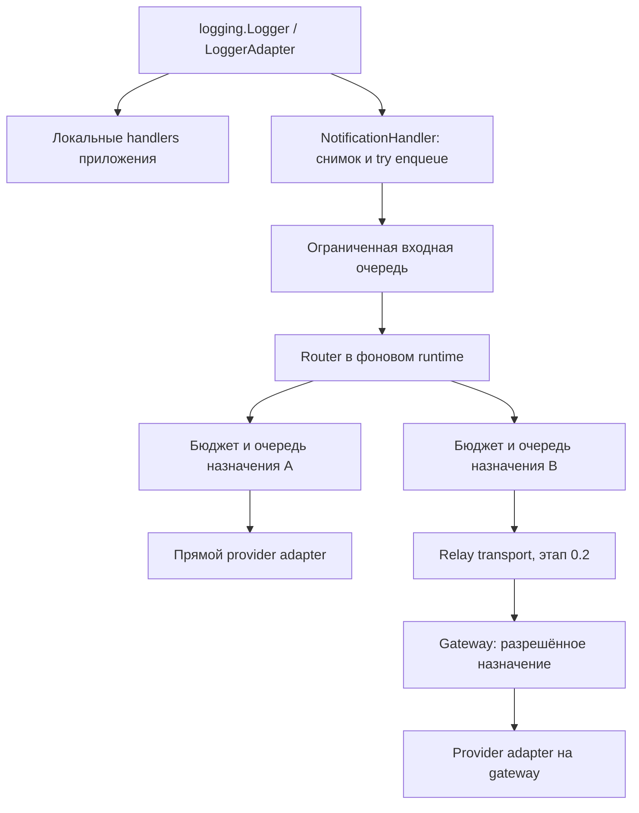

# Remote Watch — архитектура

Version 1.2.9

Автор: Sergey Fundobny (silverbull@mail.ru) + GPT-6

Дата и время последнего изменения: 261005-202646

## Статус и границы

На 30.09.2026 базовая 0.1 принята; объём 0.2 реализован и основной RU → LV →
Telegram smoke подтверждён владельцем на телефоне после обновления venv до dev9.
Длительный mixed и автозапуск VM не проверены. В 0.3 по уточнению владельца входят
проверка состояния и resume/suspend, см. [ADR 0009](docs/adr/0009-command-scope-and-safety.md).
В 0.3.0.dev1 реализован командный контракт: JSON-схема 1, проверка конкретного
запуска приложения и hub, связь claim/grant/result/receipt, относительные сроки и переходы
без повторного старта из уже сохранённого STARTED.
В 0.3.0.dev2 реализованы проверка возраста команды по достоверному времени hub
и постоянный журнал SQLite. Обязательного подтверждения resume/suspend нет.
Возраст ограничен 120 с по умолчанию, учитываются погрешность, дрейф и срок годности
показания. В dev3 владелец выбрал TimeAPI; доступность HTTPS API подтверждена на LV VM.
Погрешность источника остаётся явным допущением. В 0.3.3.dev1 источник подключается
к hub явно; проверка возраста закрывается при утрате достоверного времени.
Журнал атомарно сохраняет команду/cursor, сравнивает версии, восстанавливает UNKNOWN
и не очищает возможное активное исполнение по одному timeout. Подробности:
[время](docs/COMMAND_TIME.md), [хранение](docs/COMMAND_STORAGE.md),
[ADR 0011](docs/adr/0011-command-time-and-durable-journal.md).
В 0.3.3.dev1 реализованы отдельные credentials/ACL, CommandHub и CommandClient,
регистрация, heartbeat, HTTPS long polling и постоянный handshake разрешения
на callback. На loopback проверен путь до подставного callback и результата.
В 0.3.4.dev1 реализован CommandDispatcher и явное подключение command_client к
RemoteWatcher. Sync callbacks/валидаторы используют один отдельный рабочий поток;
async callbacks — loop приложения, вызвавший astart. Уведомления сохраняют свой loop.
Проверка аргументов предшествует grant, последняя проверка срока — самому вызову.
После timeout UNKNOWN неизменяем; слот удерживается до фактического завершения.
Подтверждение release сохраняется и доставляется отдельно от результата, чтобы
потеря квитанции не требовала повторного callback. После закрытия/рестарта неясные
исполнения остаются для ручного разбора. В 0.3.5 реализованы Telegram/ntfy sources,
отдельный командный JSON/CLI и конечный smoke. 02.10.2026 владелец подтвердил
Telegram smoke с одним и двумя тестовыми приложениями; live ntfy commands
отложены, восстановление и внедрение в настоящее приложение ещё не проверены.
[Источник, хранение позиции и границы доверия](docs/COMMAND_SOURCES.md).
Контракт потоков, остановки и пример: [COMMAND_EXECUTION.md](docs/COMMAND_EXECUTION.md).
Контракт, пределы и семантика отказов: [COMMAND_HUB.md](docs/COMMAND_HUB.md).

В dev8 gateway JSON поддерживает token как альтернативу token_env у провайдеров
и principals. Типизированные TelegramConfig/NtfyConfig/GatewayPrincipal также
принимают literal-токен, скрытый из repr. Значения проверяются при создании
настроек, окружение разрешается при open/start. В JSON нужен ровно один ключ;
token_env=null сохраняет анонимный ntfy. Окружение процесса не изменяется.
Хеши служат для проверки сервисных токенов, literal-значения остаются в config.
Ошибки токенов содержат только известный путь поля, индекс и фиксированное объяснение.

В dev7 добавлены эксплуатационные возможности CLI: агрегированная сводка после
очистки, фиксированные коды этапа ошибки и локальный stop-file для штатной остановки.
Это не сетевой административный API. Полевой mixed-сценарий использует существующие
RelayChannel и NtfyChannel; настройки транспорта остаются на уровне назначения.
Счётчики не включают токены, адреса, alias или содержимое уведомлений.
Два отчёта dev6 и подтверждение владельца закрыли long text ntfy: 20/20 на телефоне.
Матрица CI и инструменты проверки установленного wheel описаны в [CI.md](docs/CI.md),
эксплуатация — в [GATEWAY_OPERATIONS.md](docs/GATEWAY_OPERATIONS.md).

Это спецификация целевого поведения с частичной реализацией. В текущем каркасе
есть Identity/Notification, Delivery/DeliveryResult, типизированная конфигурация,
NotificationChannel и реестр пользовательских команд. Реализован также полный путь
logging → подготовка данных → очереди → канал. Приватная версия 0.1.0 поддерживает
ограниченные повторы, full jitter, retry-after, TTL, sync/async lifecycle и счётчики
по получателям. Реализованы исходящие Telegram/ntfy. В 0.2.0.dev1 добавлены
relay-клиент, wire-контракт и длительный field smoke. В 0.2.0.dev3 реализован outbound
gateway с точной auth/ACL, ограниченным приёмом, одной provider attempt и управляемой
остановкой. Смешанный режим проверен на loopback; основной реальный маршрут подтверждён в dev9.
В 0.2.0.dev4 добавлен необязательный JSON-файл серверных настроек, схема версии 1.
Отдельный gateway_json преобразует его в прежние типизированные объекты и выбирает
только Telegram/ntfy из фиксированного списка. Core и GatewayConfig не импортируют
конкретные адаптеры. Файл не исполняет Python; с dev8 может содержать token либо ссылку token_env.
Выбор источника секрета не меняет ACL: несколько principals могут использовать один процесс и разные aliases.
Для пользовательских каналов остаётся явно доверенная Python-фабрика.
В 0.2.0.dev5 добавлены ограниченная числовая HTTP/ntfy-диагностика, relay schema 2
при сохранении schema 1 по умолчанию и ранняя проверка фиксированных wire-пределов
Notification. Обновление не меняет схему самого Notification и не включает
автоматическую повторную отправку при несовпадении протокола. Проверен настоящий
TLS на loopback с временным CA; в dev9 подтверждён и реальный HTTPS-путь RU → LV.
Решение: [ADR 0007](docs/adr/0007-delivery-diagnostics.md).
В dev6 предел текста ntfy уменьшен до 4095 байт: в двух российских отчётах dev5
ровно 4096 байт стабильно дали HTTP 500/50001. Подробности и ограничения вывода:
[NTFY_DIAGNOSTIC.md](docs/NTFY_DIAGNOSTIC.md). Это обход наблюдённой границы;
внутренний сбой провайдера неизвестен; доставка после исправления подтверждена владельцем.
Адаптеры проверены на fake HTTP/loopback; пользователь подтвердил оба smoke
на Android. Для ntfy пока используется бесплатный аккаунт без резервирования темы.
Короткая проверка трёх серверов выявила таймауты Telegram в России и ошибку размера
ntfy JSON. В 0.2.0.dev2 ntfy ограничивает как текст, так и сериализованный запрос;
слишком большие метаданные отклоняются при настройке. После dev6 подтверждены
длинные сообщения; 30.09 базовая прямая доставка принята владельцем после
примерно 12 часов RU/LV-наблюдения. Результаты и границы: [FIELD_SMOKE.md](docs/FIELD_SMOKE.md). Текущий API и границы:
[RUNTIME.md](docs/RUNTIME.md). Scope определяет
[PROJECT_BRIEF.md](PROJECT_BRIEF.md), порядок реализации —
[IMPLEMENTATION_PLAN.md](docs/IMPLEMENTATION_PLAN.md).

0.1: локальное logging и прямые исходящие Telegram/ntfy-уведомления.
0.2: необязательный relay. 0.3: отдельный приём и маршрутизация команд.
Совместимость с `fin-data.TelegramBot` не является целью.

## Структура пакета после реорганизации dev3

- `remote_watch`: основной фасад, RemoteWatcher, настройки и данные уведомлений.
- `notifications`: handler, нормализация, маршрутизация, доставка и её runtime;
  здесь же находятся частные помощники очередей, повторов и остановки.
- `commands`: registry, protocol, state, time, storage и sqlite_store.
  Старый неиспользуемый прототип подтверждения изолирован в `_confirmation`.
- `gateway`: server, config, json_config и точка запуска `__main__`.
- `adapters`: Telegram, ntfy, relay и необязательные источники времени.
- `diagnostics`: smoke, field_smoke, ntfy_diagnostic и time_probe.
- `relay_protocol.py`: общий формат relay; `adapters/relay.py` — его сетевой клиент.

Core не импортирует конкретные адаптеры. `commands.time` знает только TimeSource;
выбранный TimeAPI подключает вызывающая сторона. Перенос не включает command hub,
не меняет сетевые схемы и не добавляет обязательных runtime-зависимостей.

Основные импорты `from remote_watch import ...` и регистрация через
`remote_watch.commands` сохранены. `python -m remote_watch.gateway` работает через
`gateway.__main__`. В 0.3.3.dev1 старые smoke/field_smoke/ntfy_diagnostic
из корня удалены по решению владельца; запуск только через `remote_watch.diagnostics`.
В корне пакета остаются семь Python-файлов. CommandHub/CommandClient находятся
в `commands`, их HTTPS-транспорт — в `adapters.command_http`, отдельный сервер —
в `gateway.command_server`. Core не импортирует эти сетевые реализации.
Прямые импорты перенесённых модулей нужно обновить: например,
`remote_watch.gateway_config` → `remote_watch.gateway.config`,
`remote_watch.command_time` → `remote_watch.commands.time`. Это намеренная смена
путей в предварительной версии; широкая сеть псевдонимов не создаётся.

Эксплуатационные проверки входят в wheel, чтобы работать на VM после pip install.
Тесты разработчика остаются в `tests`, проверки оформления и дистрибутива — в `tools`.

## Основные решения

- Основной пользовательский API — `logging.Logger`, без обязательного подкласса.
- Консоль/файл и удалённые уведомления обслуживаются независимо.
- Вызов logging не выполняет сеть, не ждёт освобождения очереди и не делает retry.
- Core знает протоколы и назначения, конкретные адаптеры изолированы.
- Назначение выбирает `direct` или `relay`; код приложения от этого не зависит.
- Все очереди, активные отправки и отложенные повторы имеют конечные бюджеты.
- Один gateway владеет приёмом команд из общего канала, но исходящей отправке
  нескольких процессов gateway сам по себе не требуется.
- Нет встроенного удалённого shell или выполнения произвольного Python.

## Потоки данных

Remote Watch не перемещает существующие локальные handlers в свою очередь.
Они могут оставаться синхронными. При необходимости приложение отдельно использует
стандартный QueueHandler/QueueListener для локального I/O. Удобная настройка
пакета создаёт только явно запрошенные handlers и помнит владение ими.

Фоновый runtime использует один управляемый поток и собственный asyncio loop.
Он не меняет event loop приложения. Для каждого назначения создаётся ограниченный
исполнитель; ожидание сети или backoff не блокирует соседние назначения.
Нельзя выполнять синхронный provider SDK в этом loop. Обёртка sync-клиента через
thread pool не даёт гарантии отмены; в первых адаптерах нужен настоящий async I/O.

## Идентичность и модели

### Identity

Обязательные явно заданные поля: `service`, `environment`, `region`, `host`,
`instance_id`. Неизвестное значение задаётся явно, а не берётся из display name.
`instance_id` обозначает логическое развёртывание; одновременно работающие
instances в одной области регистрации обязаны иметь разные ID. Для каждого
запуска runtime создаётся отдельный `session_id`. Перезапуск не подменяет старую
сессию молча в command hub. LogRecord не может переопределить identity runtime.

### Notification

Неизменяемый сериализуемый снимок содержит:

- `schema_version`, `event_id`, UTC `created_at`, `expires_at`;
- identity и `session_id`;
- числовой `level_no`, текстовый `level_name`, `logger_name`;
- отформатированный `message`, необязательный текст исключения;
- необязательные `topic`, `tags`, correlation/trace IDs;
- признак явного `notify` и признаки усечения.

Сообщение и исключение фиксируются до постановки в очередь. Снимок не хранит
LogRecord, traceback, произвольные `args` и ссылки на изменяемые объекты приложения.
Разрешены только документированные поля и ограниченные простые типы метаданных.
Изменение исходного LogRecord не допускается: другие handlers должны его сохранить.
Ошибки форматирования/нормализации дают безопасную локальную диагностику и счётчик,
но не пробрасываются в приложение из handler.

Редактор чувствительных данных применяется до помещения снимка в очередь.
Полные URL с токеном, секреты конфигурации и provider payload в снимок не входят.
Редактирование не гарантирует распознавания произвольного секрета в тексте приложения.

### Destination и Delivery

`Destination` — логическое именованное назначение с фиксированными настройками:
провайдер, способ доставки, ссылка на прямую конфигурацию или relay binding,
политика очереди/retry. Один Telegram-чат и один ntfy-topic — разные назначения.
Router возвращает уникальные destination IDs, без provider-specific параметров.

`Delivery` связывает событие и одно назначение: стабильный `delivery_id`,
номер попытки и необязательный remaining_timeout. Перед send runtime задаёт
остаток срока попытки с учётом монотонного TTL и остановки; relay использует его,
чтобы не продлевать обработку новым полным таймаутом. Все повторы одной доставки используют
тот же ID. Снимок события не изменяется при рендеринге разных провайдеров.

### Результат одной попытки

| Результат | Смысл | Действие core |
| --- | --- | --- |
| `provider_accepted` | Провайдер подтвердил приём | Завершить доставку |
| `transient_failure` | Известный временный отказ | Повтор в пределах политики |
| `rate_limited` | Провайдер/relay ограничил частоту | Учесть минимальное время повтора |
| `permanent_failure` | Известный неповторяемый отказ | Завершить с ошибкой |
| `unknown` | Отправка могла состояться, подтверждения нет | Повтор по политике, возможен дубликат |

Результат содержит безопасный код причины, необязательные provider message ID
и `retry_after`, источник результата (`provider`/`relay`). Произвольное исключение
или тело HTTP-ответа не являются публичным результатом. Ошибка адаптера учитывается
как отдельная диагностика; если нельзя исключить отправку, исход считается unknown.

Постановка в локальную очередь не является результатом провайдера. Logging API
не возвращает квитанцию доставки; состояние наблюдается через статистику runtime.

## Публичные границы расширения

Модели, конфигурация, NotificationChannel, PolicyRouter, NotificationHandler,
NotificationRuntime и регистрационный контракт команд уже реализованы.
Runtime поддерживает sync/async lifecycle и повторы без освобождения слота доставки.
Наследование от framework-класса не требуется.

| Граница | Ответственность |
| --- | --- |
| `NotificationChannel` | Реализован протокол: async open(), send(Delivery) → DeliveryResult, close() |
| Delivery transport | Общий контракт отправки для direct adapter или relay client |
| `PolicyRouter` | Чистое сопоставление снимка с настроенными destination IDs |
| `NotificationHandler` | Logging integration, снимок, неблокирующий приём |
| `NotificationRuntime` | Поток/loop, очереди, расписание попыток, stats и lifecycle |
| `CommandSource` (0.3) | Отдельный поток проверяемых входящих provider events |

Send получает Delivery, а не только Notification: адаптеру нужны стабильный
delivery ID и номер попытки, в том числе для будущего relay. Фабрика Destination
создаёт канал без аргументов только при запуске runtime; конструктор
конфигурации не создаёт provider client. Close должен допускать cleanup после
частично неудачного open. Методы протокола не являются реализованной доставкой.

WatcherConfig.commands нормализует словарь callback-функций в CommandRegistry.
CommandSpec добавляет контекст, валидатор именованных строковых аргументов,
required scope, timeout, read_only и idempotent. Регистрация ничего не исполняет,
не проверяет actor и не выдаёт разрешения. В 0.3.3/0.3.4 права проверяет hub,
а dispatcher проверяет аргументы и срок перед вызовом. Пользовательский набор
команд не ограничен встроенным status.
Контракт и примеры: [COMMANDS.md](docs/COMMANDS.md),
решение: [ADR 0004](docs/adr/0004-application-command-registry.md).

Не нужно создавать два одинаковых публичных протокола отправки: общий минимальный
контракт используется как каналом, так и relay transport. Адаптер владеет своим
клиентом, создаёт и закрывает его в loop runtime и не запускает скрытые повторы.
SDK retries должны быть отключены или включены в явно определённый бюджет.
В 0.1 custom adapter передаётся объектом/фабрикой; entry-point discovery отложен.

В 0.1.0.dev3 TelegramChannel/NtfyChannel используют общий внутренний HTTP-слой
на optional aiohttp. Сессия создаётся в open и принадлежит одному назначению/loop.
Конструкторы не импортируют aiohttp; core не импортирует adapters. ProviderConfig.destination()
передаёт одинаковую RetryPolicy фабрике канала и runtime. Secrets задаются именами
переменных окружения и разрешаются в open; общий secret-provider пока не реализован.
Один POST, запрет redirects/cookies/env proxy, проверка TLS и ограничение ответа 64 KiB
делают попытку явной и ограниченной. Неясный успех классифицируется как unknown.
Текст сокращается до ограничений канала с видимым маркером, без разделения на сообщения.
HTTP и базовые адреса сервисов настраиваются явно; это не реализация relay.
Точные настройки, причины выбора клиента и классификация: [ADAPTERS.md](docs/ADAPTERS.md).

В 0.1.0.dev4 добавлена явная команда `python -m remote_watch.diagnostics.smoke telegram|ntfy`.
Она читает только выбранную секцию локального credentials-файла, временно передаёт
токен существующему адаптеру через уникальное имя в окружении своего процесса
и очищает его при выходе. Файл не меняется; его значения и исходные исключения
не выводятся. Это отдельный инструмент ручной проверки, не config-loader runtime:
обычный импорт/pytest не читает локальные credentials и не включает реальную отправку.

## Logging и маршрутизация

Приложение может подключить handler к существующему logger либо воспользоваться
RemoteWatcher, который владеет runtime и своими локальными handlers. Его `.logger` —
переданный Logger/LoggerAdapter либо обычный `logging.getLogger(identity.service)`.
Уровень logger, propagation, filters и чужие handlers сохраняются. ConsoleConfig и
RotatingFileConfig включаются только явно; файл открывается при start до запуска сети.
При ошибке запуска выполняется откат, при stop снимаются и закрываются свои handlers.
После stop нужен новый объект; async-отмена дожидается очистки. Lifecycle принадлежит
приложению и запрещён из callback адаптера/redactor. Локальный write/flush имеет
обычные ограничения синхронного logging и не входит в сетевой deadline.
Подробности: [WATCHER.md](docs/WATCHER.md). Импорт пакета ничего не запускает.
Повторная настройка не добавляет тот же handler дважды. Helper не вызывает
глобальный `basicConfig`, не отключает чужие loggers и не меняет их уровни молча.

Порядок eligibility:

1. Стандартные уровни/фильтры logging уже должны пропустить запись.
2. Внутренние диагностические записи и `notify=False` исключаются.
3. `notify=True` снимает только remote-порог severity, но не ограничения правила.
4. Без флага remote-порог по умолчанию равен ERROR.
5. Проверяются topic, tags и identity; подходящие правила объединяют назначения.

Поля внутри правила соединяются AND, правила — OR. Все заданные required tags
должны присутствовать. Неверный тип метаданных не превращается в разрешение:
запись не отправляется, ошибка учитывается. Нет совпадения — нет доставки.
Один destination ID выбирается один раз. Неизвестный destination ID в конфигурации
является ошибкой запуска. Переадресация через LogRecord, quiet hours, fallback,
escalation и произвольные выполняемые выражения в 0.1 не поддерживаются.

Один runtime рекомендуется прикреплять один раз в выбранной logger hierarchy.
Подключение разных runtime к предку и потомку может намеренно дать две отправки;
универсальная дедупликация всех пользовательских logging-конфигураций не обещается.

## Очереди, retry и гарантии

Конкретные исходные лимиты заданы в [CONFIGURATION.md](docs/CONFIGURATION.md).
Входная очередь ограничивает снимки. Очередь каждого назначения учитывает всю
незавершённую работу: ожидание, активную отправку и delayed retry. Перенос в retry
не освобождает слот. Число назначений ограничено. Входной consumer ограничивает
объём одной порции работы и уступает loop для обслуживания отправок.

Пробуждение loop объединяется: нельзя ставить неограниченное число callbacks
через thread-safe bridge при ограниченной входной очереди. Будущие задания не
создаются как отдельные unbounded tasks. Лимит относится к удерживаемым данным
пакета, а не к общей памяти процесса или временным затратам `str()` приложения.

При переполнении отбрасывается новая запись/доставка без ожидания, включая CRITICAL.
Переполнение одного назначения не отменяет доставку в другие. По умолчанию одна
активная отправка на назначение; retry сохраняет голову очереди, соседние назначения
независимы. Между процессами и по фактическому появлению у провайдера порядка нет.

Retry использует exponential backoff с full jitter; число попыток включает первую.
Provider retry-after задаёт нижнюю границу ожидания, а не повод превысить expiry
или shutdown deadline. Истечение TTL завершает доставку до следующей попытки.
Для конкретного назначения deadline не позже Notification.expires_at и created_at
плюс его RetryPolicy.ttl. UTC используется в данных, monotonic clock — для локальных задержек/deadlines.
На входе relay оставшийся TTL ограничивается его собственной политикой.
С dev9 явный GatewayConfig.clock_skew_tolerance (0–3600 с, по умолчанию 0)
ослабляет сравнения UTC клиента и сервера в обе стороны. Он не увеличивает
относительные timeout/remaining_ttl или локальные монотонные сроки; даты события
не меняются. В пределах допуска сервер не отличает задержанный запрос от свежего
с отстающей VM. Область действия — только outbound, без автоматического переноса
на команды. Формулы, совместимость и ограничения: [ADR 0008](docs/adr/0008-relay-clock-skew.md).

Гарантия 0.1 — best effort в памяти с ограниченными повторами. Нет гарантии даже
первой попытки для каждого события; авария процесса теряет очередь. Возможны
дубликаты при неизвестном исходе и потери при переполнении/expiry/остановке.
Durable outbox потребует отдельного ADR про commit, восстановление и retention.

## Lifecycle и диагностика

Ниже описано целевое поведение полного 0.1. В шаге 2 уже есть sync start/stop,
контекстный менеджер, ограниченные очереди, сроки запуска/остановки/попытки и TTL.
Для отмены и закрытия резервируется меньшая величина из 0.1 секунды и 20% срока
запуска/остановки; это часть общего бюджета, не дополнительное ожидание.
В шаге 3 добавлены astart/astop, async with и общий секундный бюджет ожидания atexit.
Отменённый astart сначала завершает уже запущенный start, затем закрывает runtime;
отменённый astop дожидается завершения остановки. Loop приложения при этом не блокируется.
Подменяемые DeliveryClock и random_source используются для сроков доставки и backoff;
сроки start/stop и timeout активного send используют реальные монотонные часы/asyncio.
Отдельный диагностический sink не включён: для 0.1 используются опрашиваемые counters.
Ошибки наблюдаются через безопасные счётчики без вывода исходных исключений.
Перечень реализованных счётчиков и единицы измерения приведены в RUNTIME.md.

Состояния: CREATED → RUNNING → STOPPING → CLOSED; ошибка запуска → FAILED.
Повторный start в RUNNING и stop в CLOSED безопасны. CLOSED/FAILED не перезапускается:
создаётся новый runtime. Stop до start закрывает runtime без запуска worker.
Вне RUNNING handler отбрасывает запись с причиной `not_running`.

Валидация конфигурации предшествует созданию ресурсов. Start имеет deadline,
создаёт loop и клиенты, откатывает уже открытые ресурсы при ошибке. Open не должен
требовать сетевой проверки доступности провайдера. Недоступность сети после запуска
обрабатывается доставкой и не препятствует работе локальных handlers.

Stop атомарно закрывает приём, дренирует принятую работу до общего deadline,
отменяет остаток и закрывает клиентов в оставшееся время. Активная отправка при
отмене может иметь неизвестный исход, его нельзя назвать гарантированно неотправленным.
Есть sync- и async-варианты lifecycle/context manager; async-вариант не блокирует
loop приложения при ожидании фонового потока. `atexit` — ограниченный best effort.
NotificationRuntime.stop из самого worker только запрашивает остановку.
Lifecycle RemoteWatcher вызывается приложением; из callback он отклоняется.
Клиенты закрываются параллельно в общем shutdown budget; число задач закрытия
ограничено числом получателей. Медленный close не должен мешать здоровым клиентам.
Часть оставшегося срока резервируется для завершения loop и потока.

Гарантии shutdown требуют кооперативной отмены адаптеров. Runtime не способен
принудительно остановить чужой Python-код, блокирующий его поток. Это нарушение
контракта адаптера, проверяемое contract tests. После fork runtime создаётся заново;
совместная очередь разных процессов и наследование живого worker не поддерживаются.

Счётчики отдельно показывают события и доставки: admitted, suppressed,
normalization_failed, ingress_overflow, destination_overflow, accepted, retries,
unknown_attempts, permanent_failure, exhausted, expired, shutdown_discarded,
shutdown_unknown, not_running. Snapshot статистики потокобезопасен; знаменатели
и единицы документируются. Payload и токены не являются labels статистики.

Внутренние ошибки учитываются счётчиками; библиотека не пишет тексты ошибок адаптеров.
Зарезервирован namespace `remote_watch.internal`. Если в дальнейшем появится отдельный
локальный sink, он должен отключать propagation и ограничивать частоту. Handler исключает namespace и
контекст выполнения доставки, включая логи HTTP-зависимостей. Сбои sink не вызывают
его рекурсивно. Внешние callbacks, если появятся, также должны иметь пределы
выполнения и изоляцию; в 0.1 достаточно опрашиваемых counters.

## Необязательная доставка через gateway

Способ доставки — настройка назначения, не новый тип события или logging API.
В direct-режиме клиент и provider credentials находятся у приложения. В relay-режиме
приложение знает HTTPS endpoint, собственную service credential и remote destination
alias; provider credentials и адресат находятся на gateway. Приложению не нужен
provider SDK для relayed-назначения.

Один процесс может одновременно отправлять Telegram через relay, а ntfy напрямую.
Relay — прикладной сервис Remote Watch, не HTTP proxy и не собственный сервер ntfy.
Переключение direct/relay явно задаётся при старте; автоматического fallback нет.
Gateway разрешает отправителю только назначенные aliases, не принимает произвольные
URL, chat IDs, токены или цепочку следующего relay из события.

Первая итерация 0.2 реализует клиент RelayChannel, RelayConfig и RelayRequest.
Протокол v1: POST /v1/notifications, Bearer auth, точный JSON envelope, 64 KiB request
и 4 KiB response. Ответ коррелируется с delivery_id и attempt; malformed 2xx даёт UNKNOWN.
В 0.2.0.dev3 сервер проверяет token → точная identity + aliases. Подробности: [RELAY.md](docs/RELAY.md),
[ADR 0005](docs/adr/0005-relay-wire-and-packaging.md).

Полный этап 0.2 использует ограниченный одноступенчатый relay: запрос приводит к одной попытке
provider adapter; ответ сообщает её результат. Relay не отвечает успехом лишь
потому, что запрос поставлен в память. Повторы выполняет исходный runtime;
relay не добавляет второй скрытый цикл retry. Timeout ответа допускает дубликаты.
Gateway ограничивает concurrency, размеры и частоту на service/destination;
при перегрузке возвращает явный временный отказ. Wire schema версионируется,
`delivery_id` сохраняется, несовместимые версии отклоняются.

На сервере нет очереди: capacity резервируется до чтения тела, один alias выполняет
одну отправку. Для public ingress ограничения TCP/TLS-соединений и чтения заголовков
обеспечивает reverse proxy; capacity не ограничивает все внутренние объекты HTTP-сервера.
Настройки и честные границы: [GATEWAY_SERVER.md](docs/GATEWAY_SERVER.md),
[ADR 0006](docs/adr/0006-gateway-admission-and-lifecycle.md).

Переход к асинхронному `relay_accepted`/receipt и durable хранению является отдельным
расширением с новыми гарантиями. Детали: [GATEWAY.md](docs/GATEWAY.md).

## Команды и безопасность

Command hub имеет отдельный inbound protocol, credentials, очереди и ACL.
Outbound relay не включает приём команд. Для общего command channel gateway
является единственным владельцем polling/webhook/sync state по политике проекта;
конкретные гарантии потребления зависят от провайдера, не от общего предположения
о едином типе update stream для всех мессенджеров.

Instances регистрируются с проверенной service identity, session ID, capabilities
и heartbeat. Команда содержит command ID, actor ID из проверенного provider event,
source conversation, точную цель, имя, валидированные аргументы, expiry и correlation.
Display name и текст сообщения не удостоверяют пользователя. Проверки ACL применяются
к пользователю, операции и целевой группе; приложение повторно проверяет scope.

Команды полностью определяет приложение при создании конфигурации
RemoteWatcher: словарём callbacks или явными CommandSpec. Callback может привязать
состояние приложения через partial; эти ссылки не сериализуются и не передаются hub.
Hub видит только capability metadata и проверенные запросы. Начальная реализация
приёма команд проверяет read-only `status` как приёмочный сценарий, а не как
единственное допустимое имя пользовательской команды.

Первый сценарий — read-only `status` одному живому instance через authenticated
HTTPS long polling. Нужны expiry, replay protection, аудит, ограничение частоты,
lease/ack и учёт ответа. Истёкшие/повторные команды не выполняются как новые.
После сбоя между действием и записью результата возможен unknown outcome: хранение
command ID само по себе не делает произвольный side effect exactly-once.
После этого сценария в ту же 0.3 входят resume/suspend с устойчивым учётом начала
исполнения и unknown без автоматического повторного callback. Разница часов VM
учитывается отдельным командным контрактом; допуск expiry уведомлений не переносится.
Broadcast и групповые операции отложены. Направление и оставшиеся решения — в ADR 0009.

TLS с проверкой сертификата обязателен для remote соединений. Секреты передаются
через явную конфигурацию token/token_env; они не входят в repr, audit и исключения.
Gateway сверяет identity с service credential. ACL закрыты по умолчанию.
Аудит и replay state требуют ограниченного хранения и политики очистки; их отказ
в command mode должен закрывать приём команд. Провайдерные redirects не должны
пересылать credentials другому host. Никаких live credentials в тестах.

## Границы пакета и проверки

Реализованный layout — `src/remote_watch`, `tests/unit`, `tests/contract`,
`tests/integration`. Модули появляются только вместе с поведением: модели,
logging integration, routing, runtime, адаптеры, затем relay и commands.
Core не импортирует Telegram/ntfy/Matrix SDK. Provider dependencies — optional
extras с первого релиза. Импорт core работает без них.

Gateway входит в ту же distribution с optional extra gateway и отдельной CLI
`python -m remote_watch.gateway`. JSON/Python-конфигурация реализована; отдельная
distribution для сервера в 0.2 не потребовалась.
Тестовые контракты: [VALIDATION.md](docs/VALIDATION.md), правила разработки:
[DEVELOPMENT.md](docs/DEVELOPMENT.md), решения: [ADR](docs/adr/README.md).

## Источники команд 0.3.5

`commands.source_protocol` задаёт независимый от провайдера контракт событий.
`commands.source` связывает его с hub; конкретные Telegram/ntfy readers создаёт
`gateway.command_service`. Приложения продолжают использовать обычный Logger.
Командный JSON загружает только типизированные настройки, не импортирует factories
из произвольных Python-путей и не определяет callbacks вместо приложения.

Отдельный `python -m remote_watch.gateway.commands` по умолчанию использует порт
8766. Уведомления через relay 8765 и входящие команды не включают друг друга.
Общий state_dir хранит hub и source SQLite; блокировка процесса предшествует
открытию нового поколения hub. Перезапуск сохраняет выбранный command_id/session,
а очистка ID оставляет необратимую границу дат. Это предотвращает переназначение
после сбоя и оживление удалённых событий после отката внешнего времени.

Telegram принимает только удостоверенные original human messages; ntfy связывает
право записи закрытого command topic с одним явно заданным actor. Для ntfy нужен
отдельный закрытый reply topic и проверенные оператором ACL. Нет выводимого из
текста имени пользователя, пересылки произвольных reply URL, remote shell/eval,
broadcast или распределённого выбора владельца. Возможен повтор ответа после
потери квитанции провайдера, но не повтор callback по этой причине.

Лимиты, настройка, восстановление и полевая проверка: [COMMAND_SOURCES.md](docs/COMMAND_SOURCES.md).

## Эксплуатационный слой после Telegram smoke

В 0.3.6.dev1 реализована предварительная наблюдаемость: CommandHub.health и
CommandGateway.stats различают запуск, пригодность UTC, отказ обслуживания и
остановку источника. Неожиданное завершение критической задачи закрывает
последующие обращения к hub; отдельный командный CLI завершает работу при
фатальном отказе. Ошибка времени допускает восстановление прежним источником,
без ослабления проверки свежести. Это локальная диагностика, без нового HTTP API,
автоматического перезапуска или смены схемы wire/JSON. Незавершённые операции
сохраняют прежнюю семантику журналов и UNKNOWN.

Базовый Telegram command smoke с одним и двумя тестовыми приложениями подтверждён
владельцем 02.10.2026. Live ntfy commands отложены; исходящая доставка не меняется.
Владелец согласовал этап 0.4: единый управляющий gateway_server, отдельные
процессы notifications/commands, external/managed Caddy, подготовка deployment
и безопасная диагностика. В 0.4.1.dev1 реализованы настройки, локальная проверка
связанных конфигов и ограниченный RestartBudget. Пакет `gateway_server` добавлен
рядом с `gateway`; импорты не запускают процессы и не требуют extras.
Общий JSON сохраняет прежние конфиги и базы относительных путей, не объединяет
секреты или outbound/command grants. Внутренние listeners только loopback.

[ADR 0012](docs/adr/0012-gateway-deployment-and-supervision.md) фиксирует ownership,
readiness, перезапуски, shutdown и сохранение журналов/CA. Схема:
[GATEWAY_DEPLOYMENT.md](docs/GATEWAY_DEPLOYMENT.md). Управление процессами — 0.4.2,
а deploy/doctor/служба ОС остаются последующими шагами
[плана](docs/GATEWAY_OPERATIONS_PLAN.md). Supervisor не заменяет службу ОС.
Перезапуск hub не регистрирует клиентские сессии автоматически; восстановление
командного пути приложения требует отдельной проверки и согласованного lifecycle.

## Явное доверие CA relay-клиента (0.4.1.dev5)

RelayConfig принимает проверяющий ssl_context, передаваемый собственному HTTP connector.
Контекст добавляет частный CA только выбранному клиенту; библиотека не меняет окружение,
глобальные TLS defaults или trust store ОС. None оставляет стандартное доверие.
Контекст не входит в wire и repr. Проверки цепочки и имени обязательны при конфигурации
и открытии канала; вызывающий код не должен менять переданный контекст.

## Безопасная причина старта и коды командного HTTP (0.4.1.dev6)

Синхронный CommandRuntime переносит из фонового потока новое исключение известной
категории с фиксированным текстом. Исходные args/traceback/context/notes не переносятся;
у точного CommandError сохраняются проверенные code/http_status. Верхний unavailable
и откат запуска сохранены. Это устраняет раскрытие приватного текста через __cause__.

Общая таблица кодов и HTTP-статусов связывает сервер и клиент. Клиент принимает
единственное поле code в JSON до 256 байт без дублей, сжатия и перенаправлений.
Неизвестное/повреждённое тело сохраняет классификацию по HTTP-статусу; полученный
статус не теряется при последующем отказе чтения или разбора. Формат запросов,
ACL, привязка к сессии, журналы и правила исполнения callback не меняются.
Подробности и границы: [COMMAND_EXECUTION.md](docs/COMMAND_EXECUTION.md).
