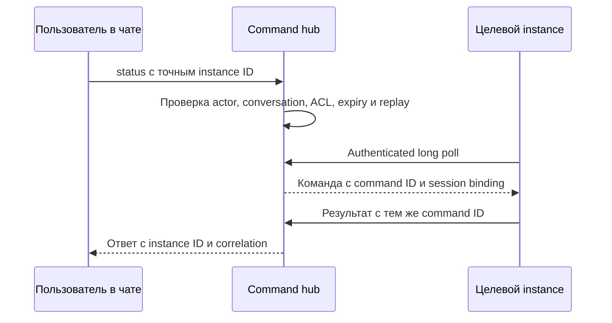

# Необязательный gateway

Version 1.0.4

Автор: Sergey Fundobny (silverbull@mail.ru) + GPT-6

Дата и время последнего изменения: 260930-172038

## Текущая реализация

В 0.2.0.dev3 готовы wire-контракт, relay-клиент и серверный gateway с auth/ACL,
ограниченным приёмом и одной provider attempt. Смешанный режим проверен на loopback.
Настройка: [GATEWAY_SERVER.md](GATEWAY_SERVER.md). Конкретная
схема и сроки: [RELAY.md](RELAY.md); упаковка: [ADR 0005](adr/0005-relay-wire-and-packaging.md).
Outbound-разделы реализованы в описанных границах. 30.09.2026 владелец подтвердил
реальный RU → HTTPS gateway LV → Telegram smoke после обновления venv до dev9.
Длительная эксплуатация и автозапуск не подтверждены; [итоги](REVIEW_0_1_0_2.md).
Раздел command hub остаётся проектным.

## Две отдельные возможности

| Возможность | Задача | Когда требуется |
| --- | --- | --- |
| Outbound relay, 0.2 | Доставлять события через сервер с доступом к провайдеру | Только для назначений, настроенных на relay |
| Command hub, 0.3 | Владеть входящим каналом и направлять команды instances | Для общего двустороннего канала по архитектуре проекта |

Один gateway может обслуживать обе функции, но relay-only конфигурация не создаёт
command source, registry или command endpoint. Общая исходящая отправка нескольких
instances сама по себе gateway не требует. Relay не является универсальным proxy.

## Конфигурационная граница

Приложение задаёт способ доставки каждому назначению. Router выбирает прежний
destination ID, независимо от direct/relay. Для relay приложение хранит только
адрес gateway, собственную credential и alias, разрешённый на gateway.
Provider token и chat/topic находятся на стороне gateway.

Gateway сопоставляет service credential с допустимой identity и destination aliases.
Alias не превращается в URL из запроса. Произвольная переадресация, передача provider
credentials приложением и каскад relay отключены. Разные instances могут иметь
отдельные credentials для отзыва доступа без изменения общего provider token.

## Контракт первой relay-версии

Предлагаемый transport — HTTPS request/response с версионированным JSON envelope.
Это wire-формат границы сервиса, он не навязывает JSON пользовательской конфигурации.
Путь /v1/notifications и schema v1 зафиксированы в RELAY.md и contract tests 0.2.0.dev1.

Запрос: schema version, неизменяемый Notification, destination alias, delivery ID,
номер попытки и remaining TTL. TTL на gateway ограничивается server policy;
UTC expiry дополнительно проверяется с документированной допустимой погрешностью
часов. Credential передаётся отдельным auth-механизмом, не внутри Notification.

1. Gateway проверяет TLS/auth, schema, identity, ACL, expiry, размер и capacity.
2. Для разрешённого запроса выполняет ровно одну попытку provider adapter.
3. Возвращает структурированный результат: provider accepted, transient/permanent
   failure, rate limited или unknown; безопасный код причины и optional message ID.

Запрос ожидает результат в пределах server deadline; очереди асинхронного
«принято relay, будет отправлено потом» пока нет. Capacity и concurrency ограничены;
перегрузка возвращает отказ с возможным retry-after. Server deadline меньше
client attempt timeout на согласованный запас для сети/сериализации.

Повторы принадлежат runtime приложения. Relay и provider SDK не добавляют свои
циклы retry. Потеря HTTP-ответа после успеха провайдера даёт unknown у приложения;
повтор может создать дубликат. Delivery ID помогает корреляции, но сам по себе
не является гарантией дедупликации. Disconnect клиента не доказывает отмену
уже начатого provider request. Gateway учитывает этот исход в диагностике.

Успешный HTTP-статус без валидного результата не считается доставкой. Ошибка
аутентификации/ACL не маскируется под provider outage. Нельзя возвращать
provider_accepted до подтверждения провайдера. Хранение durable receipts,
дедупликация между рестартами и asynchronous acceptance требуют отдельного ADR.

## Безопасность и эксплуатация relay

- Проверка сертификатов, отдельная credential на отправителя и закрытые ACL.
- Ограничения на service и provider destination; отсутствие общей квоты между
  независимыми direct-процессами не скрывается.
- Удаление секретов из access logs, repr и текста исключений.
- Запрет пересылки auth при redirect на другой host.
- Локальные health/diagnostics без рекурсивных уведомлений о каждой ошибке отправки.
- Graceful shutdown с отказом новым запросам и ограниченным завершением активных.

Relay добавляет зависимость от его доступности. Он полезен только если достижим
с приложений и сам может достичь провайдера. Это проверяется отдельно от чтения
архитектуры. Один gateway не означает наличие высокой доступности или failover.

## Минимальный command hub

По уточнению владельца 30.09 в первую рабочую 0.3 входят также resume/suspend.
Сценарий status ниже остаётся первым сквозным шагом. Изменяющие callbacks требуют
устойчивого учёта исполнения и unknown без автоматического повторного запуска;
расхождение часов VM требует отдельного командного контракта. Направление и
нерешённые детали: [ADR 0009](adr/0009-command-scope-and-safety.md).

Первый provider source — Telegram для проверки общего протокола; Matrix добавляется
следующим двусторонним адаптером. Command source и outbound adapter имеют отдельные
контракты даже при использовании одного аккаунта. Настройки relay не включают команды.

Приложение не открывает входящий порт для команд: оно регистрируется и делает
authenticated long polling по HTTPS. Проверяется уникальность активной instance
identity, capabilities, session и heartbeat. Истёкшая регистрация не считается
доступной целью. Ответ старой сессии не приписывается новой.

До реализации нужны durable command/replay state, атомарная регистрация command ID,
lease/ack, bounded retention и аудит принятых/отклонённых команд. Принятие команды
не означает выполнение. Повтор подтверждённого запроса возвращает известный результат;
сбой после действия и до записи результата даёт unknown, не ложный success.
Повторное выполнение разрешается только по idempotency-контракту конкретного handler.

В первой сетевой итерации приёмочным сценарием служит read-only status одному
instance. Это не фиксированный whitelist имён в библиотеке: приложение задаёт
команды через CommandRegistry/CommandSpec при создании конфигурации watcher.
Callbacks остаются в приложении; gateway получает только разрешённые capabilities.
Значения аргументов валидируются до dispatch. Resume/suspend входят в ту же 0.3
после проверки expiry, replay, session replacement и неизвестного исхода.
Broadcast и расширенные операции вроде reload_config остаются отдельным объёмом.
Никакого произвольного shell или eval, даже для администратора.

Используется тот же репозиторий/distribution и отдельный extra gateway с aiohttp.
Core приложения не устанавливает серверный framework. Исходящий relay-клиент
устанавливается через extra relay; упаковка будущего командного клиента уточняется в 0.3.1.
