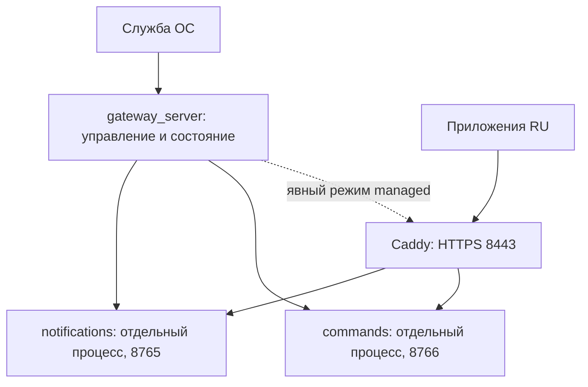

# План серверного приложения и эксплуатации gateway

Version 1.0.0

Автор: Sergey Fundobny (silverbull@mail.ru) + GPT-6

Дата и время последнего изменения: 261002-140102

Статус: предложение по итогам ревью 02.10.2026, **не реализованный интерфейс**.
Названия CLI и схема ниже предварительные. Текущий пакет остаётся 0.3.5.dev2;
действующие команды запуска описаны в [GATEWAY_TLS.md](GATEWAY_TLS.md).

Владелец подтвердил Telegram command smoke с одним и двумя тестовыми приложениями
через RU → Caddy на LV → командный gateway. Реальные командные проверки ntfy
отложены на неопределённый срок: платный аккаунт/закрытые темы сейчас не готовятся.
Это не отменяет ранее принятую исходящую доставку через ntfy.

## Назначение следующего этапа

Одна команда должна запускать нужные серверные компоненты, показывать их готовность,
вести ограниченные локальные журналы и управлять остановкой/восстановлением.
Оператору не нужно держать несколько RDP-окон и помнить разные порты.
Один deployment обслуживает несколько приложений, чатов и назначений;
по-прежнему нужны отдельные Identity и командные секреты приложений.

Предлагается этап 0.4 «Эксплуатация gateway». Не включать его задним числом
в критерии базовых 0.1/0.2 и не объявлять успешный smoke доказательством работы 24/7.
До него — небольшой шаг 0.3.6 с исправлением наблюдаемости фоновых задач и ошибок
конфигурации. Результаты ревью: [REVIEW_0_1_0_3.md](REVIEW_0_1_0_3.md).

## Одна точка запуска, раздельные компоненты

Предлагаемый entry point: `python -m remote_watch.gateway_server --config ...`.
Он входит в ту же distribution, использует optional extras и композицию существующих
Gateway/CommandGateway. Core библиотеки не получает серверных зависимостей.

Для первого варианта рекомендуется управляющий процесс и отдельные дочерние
процессы notifications/commands. Это сохраняет границы отказа: перезапуск доставки
не меняет поколение командного hub и не обрывает все его сессии. Отдельный процесс
также позволяет закончить зависший компонент после конечного периода остановки.
Цена решения — локальный протокол состояния и управление процессами Windows/Linux;
это нужно покрыть контрактными тестами, а не скрывать за бесконечным restart loop.
Произвольные программы и команды оболочки через серверный JSON не запускаются.



Caddy остаётся отдельным TLS-сервисом. Два явных режима:

- `external`: Caddy уже запущен оператором/службой; gateway_server проверяет
  доступность, но не останавливает и не перезапускает чужой процесс.
- `managed`: gateway_server запускает указанный локальный Caddy, владеет именно
  своим дочерним процессом и останавливает его при штатном завершении.

Для текущих VM режим managed даст один ручной запуск; переход со старой схемы
потребует остановить прежние процессы и сохранить действующий Caddyfile,
каталог caddy-data, CA и журналы команд. Не генерировать новый CA при каждом
deploy и не менять доверенный root.crt на RU без отдельного решения.
На уровне процессов запрещены два владельца одного компонента. Занятый порт
не является разрешением уничтожить найденный по нему процесс.

## Конфигурация

Рекомендуются **три небольших JSON**, а не один общий файл со всеми секретами:

- `gateway_server.local.json`: состав deployment, ссылки на конфиги компонентов,
  локальные listener-адреса/порты, Caddy, каталоги журналов и политика восстановления.
- `notifications.local.json`: существующая схема gateway с destinations/principals.
- `commands.local.json`: существующая схема command gateway с targets/principals/sources.

Старые имена gateway_config.json и command_gateway.json допустимы как ссылки:
переименование не требуется. Секреты остаются в конфиге своего компонента;
поддержка literal token/token_env сохраняется. Отключённый компонент не создаёт
ресурсов, не открывает endpoints и не требует настройки другого компонента.
Общий файл имеет собственный schema_version; схемы компонентов не объединяются.

Пути deployment считаются от его JSON, пути state_dir/CA внутри компонента —
по существующим правилам от JSON компонента. Преобразование путей проверяется
до запуска. Перенос файла commands в другую папку не должен незаметно создать
пустой state_dir: миграция сохраняет абсолютное расположение действующих журналов.

Публичный endpoint задаётся один раз для генерации шаблонов: для владельца
`https://АДРЕС_LV:8443`. Шаблоны Caddy и клиентских настроек получают согласованные
порты из deployment. Существующий вручную изменённый Caddyfile не перезаписывается;
диагностика проверяет фактическую маршрутизацию. Межмашинный клиент никогда не
получает loopback upstream 8765/8766 в качестве внешнего адреса.

Сначала — проверка и перезапуск затронутого компонента после изменения настроек.
Hot reload ACL, токенов и журналов не входит в первый вариант.

## Готовность, ошибки и восстановление

Разделить «процесс запущен», «listener доступен», «компонент готов» и
«провайдер подтвердил отправку». Ни один из них не доказывает показ на телефоне.
Готовность команд зависит от hub maintenance, источников, доверенного времени,
журналов и listener. Недоступность TimeAPI не ослабляет проверку свежести.

Общий статус показывает состояние каждого компонента, последний безопасный код
ошибки, возраст последнего heartbeat/успешной проверки, число перезапусков,
накопленных ответов/UNKNOWN и занятость доступной ёмкости. Для времени нужна
явная причина `time_unavailable`, для конфигурации — например `duplicate_principal_token`.
Значения токенов, тексты команд, chat IDs и полные исключения не выводятся.
Локальное состояние управления должно быть доступно только владельцу deployment;
публичный health endpoint не раскрывает конфигурацию или результаты команд.

Политика восстановления:

1. Временные HTTP-ошибки обслуживают существующие retry loops. Кратковременный
   отказ Telegram/TimeAPI не является поводом немедленно перезапустить весь hub.
2. Неожиданное завершение/зависание дочернего процесса допускает ограниченный
   restart с backoff, jitter и пределом частоты. Проверять и OS process state,
   и heartbeat, который обновляется самим обслуживающим loop.
3. Ошибки конфигурации, неверные credentials, конфликт владельца или отказ
   хранилища переходят в явный failed/degraded до вмешательства оператора;
   автоматический restart не удаляет journal/lock и не исправляет ACL.
4. Рестарт команд создаёт новое поколение и сохраняет прежние SQLite-файлы,
   cursor и UNKNOWN. Возможный callback автоматически не повторяется.
5. Штатная остановка закрывает приём, даёт конечный общий бюджет завершению,
   сохраняет неизвестные исходы и закрывает своих потомков. После timeout
   допускается принудительная остановка только собственных дочерних процессов.

Отдельно проверить потерю управляющего процесса: дочерние процессы не должны
остаться неучтёнными и конкурировать со следующим запуском. Нужны подтверждённые
механизмы владения на Windows/Linux; PID без проверки происхождения недостаточен.
Статус degraded одного компонента не должен маскировать отказ остальных.
При исходной ошибке обязательного компонента старт завершается отказом с откатом
уже запущенных своих ресурсов; после успешного старта исправные компоненты могут
продолжать работу при явно показанном частичном отказе.

Логи ограничены ротацией/retention; заполнение диска и отказ записи видны в статусе.
Не пересылать сырые stdout/stderr Caddy или сторонних библиотек в пользовательские
уведомления. Падение gateway нельзя надёжно сообщить через тот же упавший gateway:
основной канал диагностики — локальный журнал и внешний контроль процесса.

## Кто обеспечивает запуск после reboot

Сам Python-процесс не может восстановить себя после собственного завершения
или выключения VM. Нужен менеджер служб ОС: для Windows предлагается служба через
WinSW с зафиксированной версией wrapper; для Linux — systemd. Caddy также описывает
служебный запуск на обеих платформах: [официальная документация](https://caddyserver.com/docs/running).

Режим Windows-службы проверяется отдельно: учётная запись, доступ к конфигам,
SQLite и прежнему caddy-data, рабочая папка, закрытие RDP, reboot и восстановление.
Установка службы требует соответствующих прав на VM; доступ к физическому хосту
не нужен. Возможные корпоративные запреты наша библиотека не обходит.
Для отдельного outbound gateway уже есть ручная инструкция Task Scheduler:
[GATEWAY_OPERATIONS.md](GATEWAY_OPERATIONS.md); она не запускает автоматически
весь новый deployment. Если службы недоступны, отдельно проверить вариант
Task Scheduler с требуемой
учётной записью и политикой перезапуска; это не эквивалент уже проверенной службе.
[Документация Task Scheduler](https://learn.microsoft.com/en-us/windows/win32/taskschd/task-scheduler-start-page).

## deploy_gateway_server

Предлагаемый инструмент создаёт в указанной папке готовый комплект для настройки:

```text
RemoteWatch/
    gateway_server.local.json
    notifications.local.json
    commands.local.json
    Caddyfile
    START_HERE.md
    start.ps1 / stop.ps1 / status.ps1 / doctor.ps1
    service/                 шаблоны установки службы
    secrets/                 сертификаты/локальные секреты оператора
    data/                    постоянные журналы компонентов
    logs/                    ограниченные журналы эксплуатации
    caddy-data/               постоянные данные Caddy
```

Это подготовка deployment, а не обещание полностью настроить чужую VM.
Первый вариант использует явно выбранный Python/venv и существующий caddy.exe;
не скачивает и не запускает произвольные binaries. В START_HERE указываются
точная версия пакета, extras и способ воспроизвести окружение. Автоматическое
создание venv можно добавить отдельным явным действием; не обновлять рабочее
окружение незафиксированной веткой main при каждом запуске сервера.

Обязательны preview/dry-run, manifest созданных файлов и отказ от перезаписи
локальных настроек по умолчанию. Обновление шаблонов показывает diff и сохраняет
пользовательские значения; данные/SQLite/CA не входят в заменяемые шаблоны.
Создание application secrets возможно отдельной опцией с записью непосредственно
в локальные файлы, без вывода в консоль. Токен Telegram и actor/chat задаёт владелец.

Шаблоны и START_HERE должны поставляться **в wheel как package resources**:
сейчас JSON-примеры находятся только в docs/sdist, поэтому нельзя рассчитывать
на checkout репозитория рядом с установленной библиотекой. Проверять установку
и deploy из чистого wheel без исходного дерева и без сети.

Служба, Windows Firewall и установка CA в доверенные ОС — отдельные явные действия.
Повторный deploy не создаёт второго читателя bot и не стартует приложение сам.
Для переноса существующей установки выдаётся отдельная памятка с сохранением
state_dir, owner/source IDs, CA и секретов; не копировать активные SQLite-файлы
по одному и не откатывать журналы команд из старой резервной копии.

## Диагностика сервера и клиента

Предлагаемый общий CLI: `python -m remote_watch.diagnostics.gateway_doctor`.
Режимы server/client используют одинаковые безопасные коды и дают текстовый
вывод для человека плюс JSON-отчёт для разбора. Имена CLI ещё не реализованы.

| Уровень | Что проверять | Чего результат не доказывает |
| --- | --- | --- |
| Offline | Версия/extras, schema, пути, разные токены, CA-файл, согласованные порты и Identity | Доступность сети и права провайдера |
| Server | Состояние своих процессов/loops, listeners, доверенное время, ёмкость и UNKNOWN | Получение на телефоне |
| Client | DNS/IP → TCP → проверяемый TLS → маршрут Caddy → отдельная read-only проверка auth/capabilities | Исполнение callback |
| Explicit live | Ограниченная реальная отправка и конечный command smoke | Круглосуточная доступность |

Для client-проверки без изменения состояния потребуется отдельный ограниченный
read-only протокол. Нельзя использовать register/start/grant как «безобидный ping».
Он не передаёт произвольный actor и не открывает доступ к чужим capabilities.
TLS проверяет chain, имя/IP и срок; диагностика никогда не предлагает verify=False.
Проверка из LV не заменяет сетевой путь с RU. Каждый сетевой шаг имеет timeout,
ограничение ответа и явную цель; это не сканер корпоративной сети.

По умолчанию offline-проверка не открывает рабочий журнал как нового владельца,
не меняет generation/cursor, не читает getUpdates рядом с работающим gateway,
не вызывает callback и не посылает уведомления. Наблюдение работающего сервера
идёт через его безопасный status; для остановленного журнала нужен отдельный
режим чтения без recovery/migration/write. Запрет изменения проверяется тестами.

Утилита получения actor/chat IDs полезна, но это отдельная явная onboarding-операция
при остановленном reader, а не часть обычного health check. Она печатает только
необходимые ID и не сохраняет токен/полный provider payload в отчёт.

## Порядок работ и критерии завершения

| Шаг | Результат | Проверка |
| --- | --- | --- |
| 0.3.6 | Наблюдаемость hub/source tasks, trusted time и понятные config errors | Искусственный отказ фоновой задачи/UTC виден; ACL и сроки не ослаблены |
| 0.4.1 | Контракт deployment, health, restart и shutdown; ADR | Согласованы владение Caddy, хранение состояния, ошибки и миграция |
| 0.4.2 | gateway_server и локальные start/stop/status | Notifications-only, commands-only, оба; второй владелец; crash/hang; bounded restart; rollback запуска |
| 0.4.3 | deploy_gateway_server и ресурсы wheel | Новая/существующая папка, Unicode/пробелы в пути, dry-run, отсутствие перезаписи CA/SQLite/секретов |
| 0.4.4 | gateway_doctor для сервера/клиента | Различаются неверный порт, TLS, маршрут, credentials, TimeAPI; проверки не меняют состояние |
| 0.4.5 | Windows-служба, журналирование и эксплуатационная приёмка | Закрытие RDP, reboot, потеря сети/провайдера, crash компонента/manager, сохранение CA и journal |
| Отдельная задача | Подключение одного настоящего приложения | Его status/resume/suspend и смысл UNKNOWN, без конфликтующего старого bot reader |

Автотесты сервисного слоя нужны на Windows/Linux; новый CI запускать для крупных
проверяемых частей, а не каждого документационного коммита. Проверки с реальными
VM выполняются владельцем, отдельно от fake/loopback тестов. Минимальная полевая
приёмка включает уведомление через relay и команду каждому из двух instances
до/после восстановления, без автоматического повтора callback.

HA, публичная публикация, Matrix, email, массовые команды, автоматический разбор
UNKNOWN и durable notification outbox остаются отдельными задачами. Отложенный
live ntfy command smoke не блокирует выбранный Telegram deployment.
