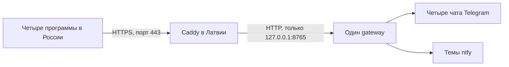
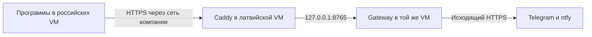

# HTTPS для gateway на Windows

Version 1.0.1

Автор: Sergey Fundobny (silverbull@mail.ru) + GPT-6

Дата и время последнего изменения: 260929-185913

## Схема для сервера в Латвии

TLS шифрует связь приложения с gateway и позволяет клиенту проверить, что он
подключился к нужному серверу. Сервисный токен затем определяет права приложения.
Это разные проверки: HTTPS не заменяет токены и список разрешённых назначений.

Для Windows без собственного домена предлагается сначала получить публичное
DNS-имя, указывающее на IP сервера. Подойдёт имя в собственном домене или имя,
предоставленное DNS/DDNS-сервисом. Сайт и отдельный веб-хостинг не нужны.
Перед gateway работает Caddy: он принимает HTTPS, получает и продлевает сертификат,
затем передаёт запрос локальному gateway. Это предусмотрено его
[автоматическим HTTPS](https://caddyserver.com/docs/automatic-https).



Число программ и чатов не определяет число сертификатов. Для одного публичного
имени gateway достаточно одного сертификата и одного процесса Caddy.
Проверен локальный HTTP-путь; размещение Caddy/TLS на реальной машине пока не проверено.

С 0.2.0.dev5 проверен также настоящий локальный HTTPS-путь: доверенный сертификат,
отказ при неизвестном центре, неверном имени и истёкшем сроке, отказ HTTP на TLS-порту,
а также загрузка сертификата и ключа через CLI. Сертификаты создаются в тестах;
эта проверка не подтверждает настройки сети компании или выпуск рабочего сертификата.

## Если доступны только VM, а физические серверы принадлежат компании

Это нормальная схема развёртывания. Caddy и gateway устанавливаются **внутри
латвийской VM**, приложения остаются внутри российских VM. Доступ к физическому
серверу, гипервизору или стойке для работы библиотеки не нужен. Возможность
размещения определяется правами в гостевой Windows и сетевыми правилами компании.



Успешный вход по RDP доказывает только доступность настроенного удалённого рабочего
стола. Он не доказывает, что у VM собственный публичный IP, что порт 443 свободен
или что компания разрешает принимать на нём соединения.

| Что требуется | Что можно сделать внутри VM | Когда нужен администратор компании |
| --- | --- | --- |
| Установить Python, пакет и Caddy | При достаточных правах Windows, в разрешённом каталоге | Ограничена установка/запуск программ или нет прав на службу |
| Принимать HTTPS | Настроить локальный Windows Firewall при наличии прав | Внешний firewall, security group или правила межсегментного доступа блокируют порт |
| Направить внешний адрес на VM | Ничего не менять на физическом сервере | Нужен NAT/port forwarding либо публикация через корпоративный reverse proxy |
| Имя и сертификат | Использовать выданные DNS-имя и сертификат либо автоматический выпуск | DNS принадлежит компании, нужен её сертификат/центр сертификации или выпуск ACME запрещён |
| Сохранять работу после выхода из RDP | Настроить разрешённый автозапуск процессов | Нужна служебная учётная запись, права службы или согласование политики |

Сначала выясните, какой из вариантов предоставляет компания:

1. **VM с доступным публичным адресом.** Применяется описанная ниже схема
   Caddy + DNS + 80/443. Локальный firewall и внешние правила — разные настройки.
2. **VM за NAT.** Администратор направляет внешний TCP 443 на Caddy внутри VM.
   Для стандартного HTTP-01 выпуска/продления нужен также доступный TCP 80;
   альтернативно администратор организует DNS-01 или предоставляет сертификат.
3. **Есть корпоративная сеть/VPN между VM.** Gateway доступен только по ней;
   публиковать его в интернет необязательно. Нужны маршрутизация и разрешение
   соединений из российских VM, подходящее DNS-имя и TLS-сертификат. Если сертификат
   корпоративный, его центр должен быть доверенным для Python-клиентов на всех VM.
   Проверка только браузером не заменяет relay smoke из нужного Python-окружения.
4. **Компания уже публикует приложения через свой HTTPS-proxy.** Caddy может не
   понадобиться. Если proxy находится вне VM, соединение с gateway тоже должно
   использовать TLS: gateway разрешает обычный HTTP только на loopback. На VM
   задаются --host, --cert и --key; proxy проверяет сертификат backend. Если proxy
   работает в той же VM, он может обращаться к 127.0.0.1:8765 без второго TLS.

Если ни входящие соединения, ни корпоративная маршрутизация между VM недоступны,
одной установки библиотеки недостаточно. Нужны согласованные изменения сети либо
другое доступное место для gateway. Самостоятельный обратный туннель, обход правил
компании или новый облачный сервис эта инструкция не устанавливает.

Для обращения к администратору можно использовать такой текст:

> Нужен небольшой HTTPS-сервис внутри нашей Windows VM в Латвии. К нему должны
> обращаться приложения из наших российских VM; он отправляет уведомления
> исходящими HTTPS-запросами в Telegram/ntfy. Подскажите, доступна ли маршрутизация
> между VM и можно ли выделить DNS-имя и TCP 443 либо корпоративный HTTPS-proxy.
> Для сертификата подойдёт принятый в компании механизм; при публичном ACME нужно
> обеспечить выпуск и продление. Нужен также разрешённый автозапуск двух процессов
> (или одного gateway, если proxy уже предоставляется). Доступ к гипервизору не нужен.

Из российских VM проверяйте **выданное имя и порт**, а не адрес подключения RDP:
`Test-NetConnection ИМЯ_GATEWAY -Port 443`. При неуспехе проверяются маршрут,
NAT, внешний и локальный firewall. Эта команда не проверяет TLS и ACL;
после неё нужен relay smoke. Команды ниже настраивают содержимое VM и не заменяют
сетевую часть, находящуюся в ведении компании.

## Подготовка

1. Получите DNS-имя и задайте для него A-запись с публичным IPv4 сервера в Латвии.
   В примерах `watch.example.com` — вымышленное имя, которое надо заменить своим.
   Не добавляйте AAAA, если IPv6 не настроен и недоступен снаружи.
2. Проверьте, что порты TCP 80 и 443 свободны и входящие соединения доходят до
   сервера через защиту провайдера и Windows Firewall. Для стандартной схемы
   получения сертификата они должны быть доступны центру сертификации.
   Если машина за NAT, потребуется перенаправление портов на неё.
   Это требования [Caddy HTTPS quick-start](https://caddyserver.com/docs/quick-starts/https).
3. Установите Caddy из [официального источника](https://caddyserver.com/docs/install).
   Ниже предполагается, что caddy.exe доступен в текущем каталоге.
4. Установите библиотеку с extras gateway и нужных провайдеров; подготовьте
   [gateway_config.json](GATEWAY_SERVER.md) и окружение с токенами.

Доступность входящих портов зависит от конфигурации конкретной машины. Не нужно
отключать Windows Firewall целиком. Для закрытого использования желательно
ограничить доступ к приложению известными IP своих серверов, сохранив доступ
центра сертификации для выпуска/продления сертификата. Если ограничить 443,
нужно сохранить рабочий HTTP-01 на публичном 80 либо отдельно настроить DNS-01.

## Первый запуск

Запустите gateway с настройками по умолчанию, в отдельном терминале:

```powershell
python -m remote_watch.gateway --config gateway_config.json
```

Он слушает только 127.0.0.1:8765. Этот порт не открывайте в интернет. Создайте
рядом с caddy.exe текстовый файл `Caddyfile` без расширения .txt:

```caddyfile
watch.example.com {
    reverse_proxy 127.0.0.1:8765
}
```

Затем во втором терминале:

```powershell
.\caddy.exe validate --config .\Caddyfile --adapter caddyfile
.\caddy.exe run --config .\Caddyfile --adapter caddyfile
```

Это минимальная конфигурация шифрования и перенаправления по
[официальному примеру reverse proxy](https://caddyserver.com/docs/quick-starts/reverse-proxy).
Caddy самостоятельно получает сертификат для указанного имени. Каталог его
данных должен сохраняться и быть доступным учётной записи процесса; не удаляйте
его при каждом запуске. Gateway в этой схеме не нужны --cert и --key.

Минимальный пример не задаёт все эксплуатационные ограничения. До постоянной
работы добавьте сроки чтения заголовков/тела и максимальный размер заголовков
через [параметры Caddy servers](https://caddyserver.com/docs/caddyfile/options#servers).
Ограничения соединений и трафика на внешнем входе настройте отдельно согласно
[требованиям размещения gateway](GATEWAY_SERVER.md). Наличие Caddy само по себе
не подтверждает выполнение всех этих требований. Не включайте автоматические
повторы POST, запись Authorization или тел запросов в журналы.

## Настройка клиентов и проверка

В RelayConfig клиентов задайте endpoint `https://watch.example.com` без суффикса
/v1/notifications: адаптер добавляет путь сам. У каждого приложения свои token_env
и alias, а endpoint общий. Сервисный токен должен совпадать с токеном его principal
на gateway; Identity — со всеми пятью разрешёнными полями.

Сначала выполните `Test-NetConnection watch.example.com -Port 443` на клиентской
машине. Эта команда проверяет TCP, а не сертификат или права. Затем запустите
[relay smoke](RELAY.md). У него специальная Identity: для него временно добавляют
отдельный principal по примеру в GATEWAY_SERVER.md. Четыре principals из рабочего
JSON-примера автоматически не разрешают этому smoke доступ.

При открытии корня адреса в браузере HTTP 404 допустим: у gateway нет веб-страницы.
Ошибки сертификата нельзя исправлять отключением проверки TLS. Публичное DNS-имя
должно совпадать с адресом клиента и сертификатом; часы на машинах должны быть верны.

Для постоянной работы потребуется автозапуск **двух процессов** — Caddy и gateway —
под выбранными учётными записями. Для Caddy предусмотрена
[служба Windows](https://caddyserver.com/docs/running#windows-service).
Gateway пока не устанавливает Windows-службу автоматически. Токены должны быть
доступны именно окружению учётной записи gateway, а сертификаты — учётной записи
Caddy. Закрытие тестовых терминалов останавливает запущенные в них процессы.

## Если использовать только IP

Не подставляйте IP вместо DNS-имени в минимальный Caddyfile в расчёте на тот же
результат: по умолчанию Caddy обслуживает IP с сертификатом собственного центра,
которому удалённые клиенты автоматически не доверяют. Это описано в
[документации локального HTTPS](https://caddyserver.com/docs/automatic-https#local-https).
Работа с собственным центром сертификации требует отдельно распространить доверие
на все клиенты. Для первого развёртывания схема с публичным DNS-именем проще.
