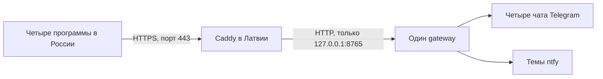

# HTTPS для gateway на Windows

Version 1.0.0

Автор: Sergey Fundobny (silverbull@mail.ru) + GPT-6

Дата и время последнего изменения: 260929-180009

## Схема для сервера в Латвии

TLS шифрует связь приложения с gateway и позволяет клиенту проверить, что он
подключился к нужному серверу. Сервисный токен затем определяет права приложения.
Это разные проверки: HTTPS не заменяет токены и список разрешённых назначений.

Для Windows без собственного домена предлагается сначала получить публичное
DNS-имя, указывающее на IP сервера. Подойдёт имя в собственном домене или имя,
предоставленное DNS/DDNS-сервисом. Сайт и отдельный веб-хостинг не нужны.
Перед gateway работает Caddy: он принимает HTTPS, получает и продлевает сертификат,
затем передаёт запрос локальному gateway. Это предусмотрено его
[автоматическим HTTPS](https://caddyserver.com/docs/automatic-https).



Число программ и чатов не определяет число сертификатов. Для одного публичного
имени gateway достаточно одного сертификата и одного процесса Caddy.
Проверен локальный HTTP-путь; размещение Caddy/TLS на реальной машине пока не проверено.

## Подготовка

1. Получите DNS-имя и задайте для него A-запись с публичным IPv4 сервера в Латвии.
   В примерах `watch.example.com` — вымышленное имя, которое надо заменить своим.
   Не добавляйте AAAA, если IPv6 не настроен и недоступен снаружи.
2. Проверьте, что порты TCP 80 и 443 свободны и входящие соединения доходят до
   сервера через защиту провайдера и Windows Firewall. Для стандартной схемы
   получения сертификата они должны быть доступны центру сертификации.
   Если машина за NAT, потребуется перенаправление портов на неё.
   Это требования [Caddy HTTPS quick-start](https://caddyserver.com/docs/quick-starts/https).
3. Установите Caddy из [официального источника](https://caddyserver.com/docs/install).
   Ниже предполагается, что caddy.exe доступен в текущем каталоге.
4. Установите библиотеку с extras gateway и нужных провайдеров; подготовьте
   [gateway_config.json](GATEWAY_SERVER.md) и окружение с токенами.

Доступность входящих портов зависит от конфигурации конкретной машины. Не нужно
отключать Windows Firewall целиком. Для закрытого использования желательно
ограничить доступ к приложению известными IP своих серверов, сохранив доступ
центра сертификации для выпуска/продления сертификата. Если ограничить 443,
нужно сохранить рабочий HTTP-01 на публичном 80 либо отдельно настроить DNS-01.

## Первый запуск

Запустите gateway с настройками по умолчанию, в отдельном терминале:

```powershell
python -m remote_watch.gateway --config gateway_config.json
```

Он слушает только 127.0.0.1:8765. Этот порт не открывайте в интернет. Создайте
рядом с caddy.exe текстовый файл `Caddyfile` без расширения .txt:

```caddyfile
watch.example.com {
    reverse_proxy 127.0.0.1:8765
}
```

Затем во втором терминале:

```powershell
.\caddy.exe validate --config .\Caddyfile --adapter caddyfile
.\caddy.exe run --config .\Caddyfile --adapter caddyfile
```

Это минимальная конфигурация шифрования и перенаправления по
[официальному примеру reverse proxy](https://caddyserver.com/docs/quick-starts/reverse-proxy).
Caddy самостоятельно получает сертификат для указанного имени. Каталог его
данных должен сохраняться и быть доступным учётной записи процесса; не удаляйте
его при каждом запуске. Gateway в этой схеме не нужны --cert и --key.

Минимальный пример не задаёт все эксплуатационные ограничения. До постоянной
работы добавьте сроки чтения заголовков/тела и максимальный размер заголовков
через [параметры Caddy servers](https://caddyserver.com/docs/caddyfile/options#servers).
Ограничения соединений и трафика на внешнем входе настройте отдельно согласно
[требованиям размещения gateway](GATEWAY_SERVER.md). Наличие Caddy само по себе
не подтверждает выполнение всех этих требований. Не включайте автоматические
повторы POST, запись Authorization или тел запросов в журналы.

## Настройка клиентов и проверка

В RelayConfig клиентов задайте endpoint `https://watch.example.com` без суффикса
/v1/notifications: адаптер добавляет путь сам. У каждого приложения свои token_env
и alias, а endpoint общий. Сервисный токен должен совпадать с токеном его principal
на gateway; Identity — со всеми пятью разрешёнными полями.

Сначала выполните `Test-NetConnection watch.example.com -Port 443` на клиентской
машине. Эта команда проверяет TCP, а не сертификат или права. Затем запустите
[relay smoke](RELAY.md). У него специальная Identity: для него временно добавляют
отдельный principal по примеру в GATEWAY_SERVER.md. Четыре principals из рабочего
JSON-примера автоматически не разрешают этому smoke доступ.

При открытии корня адреса в браузере HTTP 404 допустим: у gateway нет веб-страницы.
Ошибки сертификата нельзя исправлять отключением проверки TLS. Публичное DNS-имя
должно совпадать с адресом клиента и сертификатом; часы на машинах должны быть верны.

Для постоянной работы потребуется автозапуск **двух процессов** — Caddy и gateway —
под выбранными учётными записями. Для Caddy предусмотрена
[служба Windows](https://caddyserver.com/docs/running#windows-service).
Gateway пока не устанавливает Windows-службу автоматически. Токены должны быть
доступны именно окружению учётной записи gateway, а сертификаты — учётной записи
Caddy. Закрытие тестовых терминалов останавливает запущенные в них процессы.

## Если использовать только IP

Не подставляйте IP вместо DNS-имени в минимальный Caddyfile в расчёте на тот же
результат: по умолчанию Caddy обслуживает IP с сертификатом собственного центра,
которому удалённые клиенты автоматически не доверяют. Это описано в
[документации локального HTTPS](https://caddyserver.com/docs/automatic-https#local-https).
Работа с собственным центром сертификации требует отдельно распространить доверие
на все клиенты. Для первого развёртывания схема с публичным DNS-именем проще.
