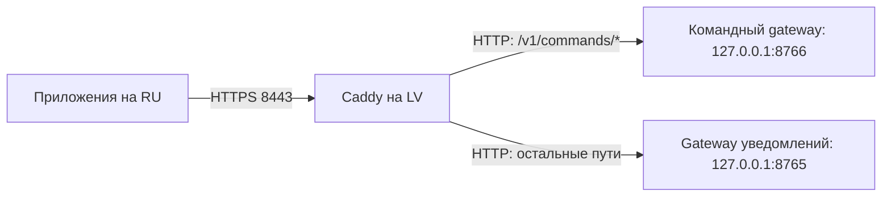
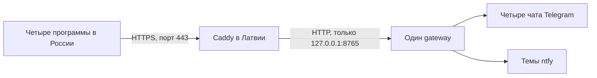
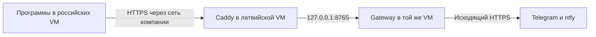

# HTTPS для gateway на Windows

Version 1.0.5

Автор: Sergey Fundobny (silverbull@mail.ru) + GPT-6

Дата и время последнего изменения: 261002-140102

## Подтверждённый маршрут владельца, 30.09.2026

Для имеющихся VM без собственного домена оказался доступен межмашинный TCP 8443.
По инструкции сеанса настроен Caddy на LV с внутренним CA, HTTPS по IP и передачей
запросов в локальный gateway 127.0.0.1:8765. На RU настроено доверие к корневому
сертификату через SSL_CERT_FILE; владелец подтвердил TLSv1.3 и затем успешный
relay smoke с немедленным появлением сообщения в Telegram.

Наличие маршрута не доказывает VPN; точные адреса и файлы сертификатов здесь
не публикуются. Публичный DNS и входящие 80/443 для этого варианта не использовались.
Ниже сохранён также вариант публичного DNS/ACME для иной схемы размещения.
Автозапуск, reboot и реальные ingress-ограничения не следуют из smoke и ещё не проверены.

## Уведомления и команды через один Caddy: вариант для VM владельца

Для обеих возможностей на LV работают три процесса. Новая схема добавляет
маршрут команд к уже проверенному HTTPS-входу 8443. 02.10.2026 владелец
подтвердил успешный Telegram command smoke с одним и двумя тестовыми приложениями
на RU; основание — сообщение в чате, без новых файлов отчёта.
Для отдельного smoke команд gateway уведомлений не требуется,
но для параллельной отправки уведомлений он остаётся запущенным.

| Процесс на LV | Назначение | Адрес прослушивания |
| --- | --- | --- |
| Caddy | Общий HTTPS-вход из RU, сертификаты и выбор gateway | Уже настроенный адрес LV, порт 8443 |
| `remote_watch.gateway` | Отправка уведомлений | `127.0.0.1:8765` |
| `remote_watch.gateway.commands` | Команды, регистрация приложений и результаты | `127.0.0.1:8766` |



Оба Python-процесса слушают loopback. Порты 8765/8766 не надо открывать между VM.
Шифрование между машинами обеспечивает Caddy; локальный участок HTTP остаётся
внутри LV. В этой схеме Python-серверам не передаются `--cert` и `--key`.

### Запуск двух gateway

В отдельных терминалах на LV, с действующими настройками каждого сервера:

```powershell
C:\Work\RemoteWatch\.venv\Scripts\python.exe -m remote_watch.gateway --config C:\Work\RemoteWatch\gateway_config.json --host 127.0.0.1 --port 8765
```

```powershell
C:\Work\RemoteWatch\.venv\Scripts\python.exe -m remote_watch.gateway.commands --config C:\Work\RemoteWatch\command_gateway.json --host 127.0.0.1 --port 8766 --allow-loopback-http
```

Если конфиг назван `command_gateway.local.json`, укажите именно это имя в
`--config`: переименовывать работающий файл не требуется. Файлы с секретами
держите вне отслеживаемых файлов git; в checkout используйте `*.local.json`.
Проверка `--check-config` только проверяет настройки и завершает процесс.
Подготовка командных секретов, прав и клиента: [COMMAND_SOURCES.md](COMMAND_SOURCES.md).

### Настройка общего HTTPS-входа

В существующем блоке адреса `https://АДРЕС_LV:8443` замените единственный
`reverse_proxy 127.0.0.1:8765` следующими двумя обработчиками:

```caddyfile
handle /v1/commands/* {
    reverse_proxy 127.0.0.1:8766
}

handle {
    reverse_proxy 127.0.0.1:8765
}
```

Это фрагмент внутри блока сайта, не полный Caddyfile. Сохраните существующие
адрес, `tls internal`, параметры хранения `caddy-data` и ограничения входящего
трафика. Используйте `handle`: путь `/v1/commands/...` должен попасть в Python
целиком. `handle_path` удаляет совпавший префикс и здесь не подходит.
[Маршрутизация Caddy](https://caddyserver.com/docs/caddyfile/directives/handle).

### validate, run и reload — разные действия

Команды выполняются из каталога с `caddy.exe` и `Caddyfile`. Запускайте Caddy
с прежними настройками каталога данных и под той же учётной записью: новый
каталог может привести к созданию другого CA, которому клиенты ещё не доверяют.

1. Проверить конфиг, не запуская сервер:

   ```powershell
   .\caddy.exe validate --config .\Caddyfile --adapter caddyfile
   ```

2. Если Caddy ещё не запущен, запустить его в третьем терминале:

   ```powershell
   .\caddy.exe run --config .\Caddyfile --adapter caddyfile
   ```

   Процесс остаётся работать в этом терминале. Не закрывайте окно и не нажимайте
   Ctrl+C, пока нужен HTTPS. Успешный `validate` сам процесс не запускает.

3. Если Caddy уже работает и надо применить изменённый Caddyfile, выполнить
   из другого терминала:

   ```powershell
   .\caddy.exe reload --config .\Caddyfile --adapter caddyfile
   ```

   `reload` обращается к управляющему интерфейсу работающего экземпляра.
   Он не запускает Caddy и не требует второго экземпляра процесса.

[Назначение команд Caddy](https://caddyserver.com/docs/command-line).

### Ошибка reload: localhost:2019 или [::1]:2019 — connection refused

Отказ при POST на `http://localhost:2019/load` означает, что по выбранному
адресу не отвечает управляющий интерфейс Caddy. `::1` — IPv6 loopback этой же
машины. Это не порт gateway и не результат проверки HTTPS между RU и LV.
Если Caddy ещё не запущен, используйте `run` из предыдущего пункта.

Если процесс уже был запущен, проверьте его и локальный listener:

```powershell
Get-Process caddy -ErrorAction SilentlyContinue
Get-NetTCPConnection -State Listen -LocalPort 2019 -ErrorAction SilentlyContinue
```

Если listener есть только на `127.0.0.1:2019`, укажите его явно:

```powershell
.\caddy.exe reload --config .\Caddyfile --adapter caddyfile --address 127.0.0.1:2019
```

При другом адресе `admin` нужен адрес действующего процесса; при `admin off`
reload недоступен. Не запускайте второй Caddy поверх работающего только ради
этой ошибки. Порт управления 2019 должен оставаться локальным, открывать его
для RU не требуется. [Настройка admin](https://caddyserver.com/docs/caddyfile/options#admin).

Предупреждение `Caddyfile input is not formatted` не объясняет отказ соединения:
оно касается оформления. При желании нормализуйте отступы и повторите validate:

```powershell
.\caddy.exe fmt --overwrite .\Caddyfile
```

### Сертификаты и клиент на RU

Закрытые ключи `.key` и обслуживаемые Caddy серверные сертификаты остаются
в `caddy-data`. Копировать их в `secrets` для Python-gateway не требуется.
Клиенту нужен только корневой сертификат CA, которому он должен доверять.
Используйте тот же `root.crt`, с которым уже прошёл relay smoke. В каталоге
данных Caddy это файл под `pki/authorities/local/root.crt`; точная начальная
часть пути зависит от настроек хранения. Не путайте его с `root.key`.
[Внутренний CA Caddy](https://caddyserver.com/docs/automatic-https#local-https).

Копию `root.crt` можно положить на RU в `secrets\root-ca.crt` рядом с клиентским
JSON либо указать существующий абсолютный путь в `ca_file`. Имя файла и папка
`secrets` — соглашение примера, не требование библиотеки. Относительный путь
считается от клиентского JSON. В нём замените поля:

```json
"endpoint": "https://АДРЕС_LV:8443",
"ca_file": "secrets/root-ca.crt"
```

Это фрагмент конфига. Адрес должен совпадать с уже проверенным именем/IP в
сертификате. Суффикс `/v1/commands` добавляет библиотека. На RU не включайте
`allow_loopback_http`: HTTPS до Caddy сохраняется, несмотря на локальный HTTP
между Caddy и gateway. Пример `https://АДРЕС_LV:8766` из прямой TLS-схемы сюда
не относится.

После запуска трёх процессов с RU проверьте TCP 8443, затем выполните
[командный smoke](COMMAND_SOURCES.md). TCP-успех не подтверждает сертификат,
права приложения и исполнение команды. HTTP 502 после успешного TLS обычно
требует проверки нужного локального gateway и порта в Caddyfile.

## Схема с публичным DNS для сервера в Латвии

TLS шифрует связь приложения с gateway и позволяет клиенту проверить, что он
подключился к нужному серверу. Сервисный токен затем определяет права приложения.
Это разные проверки: HTTPS не заменяет токены и список разрешённых назначений.

Для Windows без собственного домена предлагается сначала получить публичное
DNS-имя, указывающее на IP сервера. Подойдёт имя в собственном домене или имя,
предоставленное DNS/DDNS-сервисом. Сайт и отдельный веб-хостинг не нужны.
Перед gateway работает Caddy: он принимает HTTPS, получает и продлевает сертификат,
затем передаёт запрос локальному gateway. Это предусмотрено его
[автоматическим HTTPS](https://caddyserver.com/docs/automatic-https).



Число программ и чатов не определяет число сертификатов. Для одного публичного
имени gateway достаточно одного сертификата и одного процесса Caddy.
Реальный Caddy/TLS проверен в варианте IP + внутренний CA выше; публичный DNS/ACME не проверялся.

С 0.2.0.dev5 проверен также настоящий локальный HTTPS-путь: доверенный сертификат,
отказ при неизвестном центре, неверном имени и истёкшем сроке, отказ HTTP на TLS-порту,
а также загрузка сертификата и ключа через CLI. Сертификаты создаются в тестах;
эта проверка не подтверждает настройки сети компании или выпуск рабочего сертификата.

## Если доступны только VM, а физические серверы принадлежат компании

Это нормальная схема развёртывания. Caddy и gateway устанавливаются **внутри
латвийской VM**, приложения остаются внутри российских VM. Доступ к физическому
серверу, гипервизору или стойке для работы библиотеки не нужен. Возможность
размещения определяется правами в гостевой Windows и сетевыми правилами компании.



Успешный вход по RDP доказывает только доступность настроенного удалённого рабочего
стола. Он не доказывает, что у VM собственный публичный IP, что порт 443 свободен
или что компания разрешает принимать на нём соединения.

| Что требуется | Что можно сделать внутри VM | Когда нужен администратор компании |
| --- | --- | --- |
| Установить Python, пакет и Caddy | При достаточных правах Windows, в разрешённом каталоге | Ограничена установка/запуск программ или нет прав на службу |
| Принимать HTTPS | Настроить локальный Windows Firewall при наличии прав | Внешний firewall, security group или правила межсегментного доступа блокируют порт |
| Направить внешний адрес на VM | Ничего не менять на физическом сервере | Нужен NAT/port forwarding либо публикация через корпоративный reverse proxy |
| Имя и сертификат | Использовать выданные DNS-имя и сертификат либо автоматический выпуск | DNS принадлежит компании, нужен её сертификат/центр сертификации или выпуск ACME запрещён |
| Сохранять работу после выхода из RDP | Настроить разрешённый автозапуск процессов | Нужна служебная учётная запись, права службы или согласование политики |

Сначала выясните, какой из вариантов предоставляет компания:

1. **VM с доступным публичным адресом.** Применяется описанная ниже схема
   Caddy + DNS + 80/443. Локальный firewall и внешние правила — разные настройки.
2. **VM за NAT.** Администратор направляет внешний TCP 443 на Caddy внутри VM.
   Для стандартного HTTP-01 выпуска/продления нужен также доступный TCP 80;
   альтернативно администратор организует DNS-01 или предоставляет сертификат.
3. **Есть корпоративная сеть/VPN между VM.** Gateway доступен только по ней;
   публиковать его в интернет необязательно. Нужны маршрутизация и разрешение
   соединений из российских VM, подходящее DNS-имя и TLS-сертификат. Если сертификат
   корпоративный, его центр должен быть доверенным для Python-клиентов на всех VM.
   Проверка только браузером не заменяет relay smoke из нужного Python-окружения.
4. **Компания уже публикует приложения через свой HTTPS-proxy.** Caddy может не
   понадобиться. Если proxy находится вне VM, соединение с gateway тоже должно
   использовать TLS: gateway разрешает обычный HTTP только на loopback. На VM
   задаются --host, --cert и --key; proxy проверяет сертификат backend. Если proxy
   работает в той же VM, он может обращаться к 127.0.0.1:8765 без второго TLS.

Если ни входящие соединения, ни корпоративная маршрутизация между VM недоступны,
одной установки библиотеки недостаточно. Нужны согласованные изменения сети либо
другое доступное место для gateway. Самостоятельный обратный туннель, обход правил
компании или новый облачный сервис эта инструкция не устанавливает.

Для обращения к администратору можно использовать такой текст:

> Нужен небольшой HTTPS-сервис внутри нашей Windows VM в Латвии. К нему должны
> обращаться приложения из наших российских VM; он отправляет уведомления
> исходящими HTTPS-запросами в Telegram/ntfy. Подскажите, доступна ли маршрутизация
> между VM и можно ли выделить DNS-имя и TCP 443 либо корпоративный HTTPS-proxy.
> Для сертификата подойдёт принятый в компании механизм; при публичном ACME нужно
> обеспечить выпуск и продление. Нужен также разрешённый автозапуск двух процессов
> (или одного gateway, если proxy уже предоставляется). Доступ к гипервизору не нужен.

Из российских VM проверяйте **выданное имя и порт**, а не адрес подключения RDP:
`Test-NetConnection ИМЯ_GATEWAY -Port 443`. При неуспехе проверяются маршрут,
NAT, внешний и локальный firewall. Эта команда не проверяет TLS и ACL;
после неё нужен relay smoke. Команды ниже настраивают содержимое VM и не заменяют
сетевую часть, находящуюся в ведении компании.

## Как проверить порт и не спутать отсутствие сервиса с блокировкой

Запуск `Test-NetConnection -ComputerName <IP из ipconfig> -Port 443` на самой VM
проверяет соединение с этой же VM. Если HTTPS-сервис ещё не запущен, отрицательный
результат ожидаем. Он не доказывает запрет входа извне или запрет исходящего HTTPS.
Адрес из ipconfig может быть частным адресом сети компании, а не публичным адресом.

1. На VM посмотрите слушающие порты:

   ```powershell
   Get-NetTCPConnection -State Listen | Select-Object LocalAddress,LocalPort,OwningProcess
   ```

2. После запуска локального gateway проверьте его собственный listener:

   ```powershell
   Test-NetConnection -ComputerName 127.0.0.1 -Port 8765
   ```

   Такой listener по умолчанию доступен только внутри VM. Для других машин нужен
   HTTPS-прокси либо gateway с TLS на доступном сетевом интерфейсе.
3. Только после запуска HTTPS-listener проверяйте его с российской VM по адресу,
   который компания выделила для доступа. Например, TCP 443 или согласованный 8443.
   Если локально listener есть, а с другой машины соединения нет, проверяются
   маршруты, NAT и оба уровня firewall совместно с администратором.

Порт 80 не требуется самому gateway. Входящие 80/443 нужны стандартным способам
ACME-проверки из инструкции выше; корпоративный/заранее выданный сертификат или
DNS-01 позволяют иную схему. HTTPS может работать на согласованном нестандартном
порту, который явно указывается в endpoint. Это не обходит сетевые правила компании.
Успех TCP-теста ещё не проверяет сертификат, права приложения или доставку провайдером.
Источник: [Microsoft Test-NetConnection](https://learn.microsoft.com/en-us/powershell/module/nettcpip/test-netconnection).

## Подготовка

1. Получите DNS-имя и задайте для него A-запись с публичным IPv4 сервера в Латвии.
   В примерах `watch.example.com` — вымышленное имя, которое надо заменить своим.
   Не добавляйте AAAA, если IPv6 не настроен и недоступен снаружи.
2. Проверьте, что порты TCP 80 и 443 свободны и входящие соединения доходят до
   сервера через защиту провайдера и Windows Firewall. Для стандартной схемы
   получения сертификата они должны быть доступны центру сертификации.
   Если машина за NAT, потребуется перенаправление портов на неё.
   Это требования [Caddy HTTPS quick-start](https://caddyserver.com/docs/quick-starts/https).
3. Установите Caddy из [официального источника](https://caddyserver.com/docs/install).
   Ниже предполагается, что caddy.exe доступен в текущем каталоге.
4. Установите библиотеку с extras gateway и нужных провайдеров; подготовьте
   [gateway_config.json](GATEWAY_SERVER.md) и окружение с токенами.

Доступность входящих портов зависит от конфигурации конкретной машины. Не нужно
отключать Windows Firewall целиком. Для закрытого использования желательно
ограничить доступ к приложению известными IP своих серверов, сохранив доступ
центра сертификации для выпуска/продления сертификата. Если ограничить 443,
нужно сохранить рабочий HTTP-01 на публичном 80 либо отдельно настроить DNS-01.

## Первый запуск

Запустите gateway с настройками по умолчанию, в отдельном терминале:

```powershell
python -m remote_watch.gateway --config gateway_config.json
```

Он слушает только 127.0.0.1:8765. Этот порт не открывайте в интернет. Создайте
рядом с caddy.exe текстовый файл `Caddyfile` без расширения .txt:

```caddyfile
watch.example.com {
    reverse_proxy 127.0.0.1:8765
}
```

Затем во втором терминале:

```powershell
.\caddy.exe validate --config .\Caddyfile --adapter caddyfile
.\caddy.exe run --config .\Caddyfile --adapter caddyfile
```

Это минимальная конфигурация шифрования и перенаправления по
[официальному примеру reverse proxy](https://caddyserver.com/docs/quick-starts/reverse-proxy).
Caddy самостоятельно получает сертификат для указанного имени. Каталог его
данных должен сохраняться и быть доступным учётной записи процесса; не удаляйте
его при каждом запуске. Gateway в этой схеме не нужны --cert и --key.

Минимальный пример не задаёт все эксплуатационные ограничения. До постоянной
работы добавьте сроки чтения заголовков/тела и максимальный размер заголовков
через [параметры Caddy servers](https://caddyserver.com/docs/caddyfile/options#servers).
Ограничения соединений и трафика на внешнем входе настройте отдельно согласно
[требованиям размещения gateway](GATEWAY_SERVER.md). Наличие Caddy само по себе
не подтверждает выполнение всех этих требований. Не включайте автоматические
повторы POST, запись Authorization или тел запросов в журналы.

## Настройка клиентов и проверка

В RelayConfig клиентов задайте endpoint `https://watch.example.com` без суффикса
/v1/notifications: адаптер добавляет путь сам. У каждого приложения свои token_env
и alias, а endpoint общий. Сервисный токен должен совпадать с токеном его principal
на gateway; Identity — со всеми пятью разрешёнными полями.

Сначала выполните `Test-NetConnection watch.example.com -Port 443` на клиентской
машине. Эта команда проверяет TCP, а не сертификат или права. Затем запустите
[relay smoke](RELAY.md). У него специальная Identity: для него временно добавляют
отдельный principal по примеру в GATEWAY_SERVER.md. Четыре principals из рабочего
JSON-примера автоматически не разрешают этому smoke доступ.

При открытии корня адреса в браузере HTTP 404 допустим: у gateway нет веб-страницы.
Ошибки сертификата нельзя исправлять отключением проверки TLS. Публичное DNS-имя
должно совпадать с адресом клиента и сертификатом; часы на машинах должны быть верны.

Для постоянной работы потребуется автозапуск **двух процессов** — Caddy и gateway —
под выбранными учётными записями. Для Caddy предусмотрена
[служба Windows](https://caddyserver.com/docs/running#windows-service).
Gateway пока не устанавливает Windows-службу автоматически. Токены должны быть
доступны именно окружению учётной записи gateway, а сертификаты — учётной записи
Caddy. Закрытие тестовых терминалов останавливает запущенные в них процессы.

## Если использовать только IP

Не подставляйте IP вместо DNS-имени в минимальный Caddyfile в расчёте на тот же
результат: по умолчанию Caddy обслуживает IP с сертификатом собственного центра,
которому удалённые клиенты автоматически не доверяют. Это описано в
[документации локального HTTPS](https://caddyserver.com/docs/automatic-https#local-https).
Работа с собственным центром сертификации требует отдельно распространить доверие
на все клиенты. Владелец использовал именно IP + внутренний CA; публичный DNS не обязателен,
если между VM есть маршрут и клиенту явно задано доверие. Проверка сертификата
при этом остаётся включённой. Допуск часов relay не исправляет TLS validity;
причины ошибок сертификата и relay_expired следует различать.
