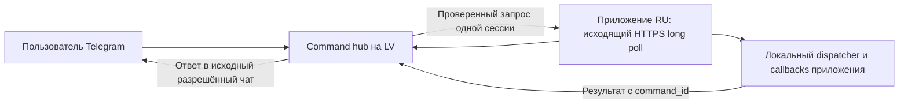

# ADR 0009: объём 0.3 и безопасное исполнение команд приложения

Version 1.0.0

Автор: Sergey Fundobny (silverbull@mail.ru) + GPT-6

Дата и время последнего изменения: 260930-171719

## Статус

Принято направление проектирования 0.3. Сетевое исполнение не реализовано.
30.09.2026 владелец подтвердил: для первого внедрения нужны и проверка состояния,
и resume_load/suspend_load. Read-only остаётся первым вертикальным шагом,
но не полным объёмом 0.3. Уточняются [ADR 0004](0004-application-command-registry.md)
и минимальный command hub из [GATEWAY.md](../GATEWAY.md).

## Схема

Command source и outbound relay — разные включаемые возможности. Сохраняется
один gateway для нескольких приложений/чатов. Bot token находится на hub;
клиент хранит отдельную command credential, которая не выдаётся автоматически
из права отправлять уведомления. Один процесс владеет каждым Telegram cursor.

Telegram getUpdates подтверждает update продвижением offset. Поэтому проектное
правило — сначала устойчиво сохранить запрос/решение, затем продвигать cursor.
Polling не запускается одновременно с webhook; наличие старого потребителя
того же bot надо проверять при миграции. Основание:
[Telegram Bot API](https://core.telegram.org/bots/api#getupdates).

## Что остаётся у приложения

Имена, callbacks/partial, аргументы и смысл результата задаёт приложение при
создании RemoteWatcher через WatcherConfig.commands. Не создаётся фиксированный
список status/resume/suspend: это приёмочные примеры. CommandSpec сохраняет
required_scope, read_only, idempotent и timeout. Словарь совместим; его команды
с False по умолчанию не объявляются безопасными/read-only по названию.

Hub разрешает комбинацию source + chat + actor + точная цель + scope/команда;
локальный dispatcher повторно проверяет разрешение, сессию и аргументы.
Читаемые aliases задаются доверенной конфигурацией и однозначно отображаются
в полную Identity; текст/название чата сами по себе права не дают.
Офлайн-цель, неоднозначная цель и старая сессия не получают отложенное изменение.

## Исполнение и неизвестный исход

Перед callback устойчиво фиксируется начало обработки command_id. Повтор того же
запроса возвращает известное состояние/результат и не вызывает callback заново.
Если процесс упал после начала действия, но до фиксации результата, возвращается
unknown; автоматического повторного вызова, в том числе после смены сессии, нет.
Истечение lease после начала действия также не разрешает повторное исполнение.
Новый запрос пользователя — новое намерение, а не скрытый транспортный retry.

Идемпотентность — заявление автора callback, не доказательство exactly-once.
Для resume/suspend предпочтительна установка желаемого состояния (clear/set),
а не toggle. Даже так повторная команда может поменять порядок намерений,
поэтому общий запрет автоматического повторного запуска сохраняется.

Возврат callback означает завершение обработчика. Если он только поставил Event,
ответ не должен обещать, что рабочая загрузка уже остановилась/возобновилась.
Проверка фактического состояния выполняется отдельной командой приложения.
Повтор отправки уже сохранённого результата не должен повторять сам callback;
дубликат ответа в Telegram при неопределённом сетевом исходе допускается явно.

## Потоки и хранилище

SQLite через стандартный sqlite3 — выбранное исходное направление для локального
журнала hub и приложения, без внешнего сервера БД. Доступ — через отдельный storage
protocol и ограниченный исполнитель, вне loop уведомлений. Соединение принадлежит
своему потоку; транзакции короткие, retention/очереди/размер результата ограничены.
Правила потоков и транзакций: [Python sqlite3](https://docs.python.org/3.10/library/sqlite3.html).
Отказ записи/audit или исчерпание места закрывают новый приём; активные защиты
от повторов не удаляются ради освобождения слота.

Для sync callbacks нужен отдельный ограниченный исполнитель, для async — явно
согласованный loop приложения. Работающий sync callback нельзя остановить отменой
Future: [Python concurrent.futures](https://docs.python.org/3.10/library/concurrent.futures.html#concurrent.futures.Future.cancel).
Timeout прекращает ожидание, но не освобождает занятый callback слот и не разрешает
повтор. Shutdown и поведение зависшего пользовательского кода должны быть честно
описаны; нельзя обещать принудительное завершение произвольной функции.

## Время: обязательный контракт до реализации

Наблюдённая разница часов RU/LV — требование к 0.3, а не особенность теста.
Допуск clock_skew_tolerance для уведомлений не переносится на изменяющие команды.
Направление: сроком команды владеет hub; локальные ожидания используют monotonic,
выданный относительный бюджет уменьшается на затраченное время запроса.
Нужны отдельные правила для давних Telegram updates, нового старта hub, скачков
UTC и утраты состояния. Нельзя продлевать старую команду новым отсчётом при restart.
До формализации и проверки этой модели удалённое изменение состояния не включается.

## Следующие конкретные решения

Перед сетевой реализацией зафиксировать wire schema, состояния claim/ack/result,
таймауты, лимиты, retention и правила восстановления; формат адресации общего чата;
контракт возврата/ошибки callback и выбор executor/loop. Это следующая работа 0.3.1,
а не уже существующие API. Порядок и критерии: [IMPLEMENTATION_PLAN.md](../IMPLEMENTATION_PLAN.md).
Broadcast, HA, Matrix, произвольный shell/Python и exactly-once не заявляются в 0.3.
